# Famous Ordinary and Stochastic Differential Equations

Many well-known physical and engineering systems are modeled using **ordinary differential equations (ODEs)** or **stochastic differential equations (SDEs)**. Nuclear reactions and jet engines are good examples, although highly detailed models often require partial differential equations (PDEs).

## Famous ODE Systems

### Radioactive Decay

The simplest nuclear-decay equation is:

```math
\frac{dN}{dt}=-\lambda N
```

where $N(t)$ is the number of radioactive nuclei and $\lambda$ is the decay constant. Its solution is:

```math
N(t)=N_0e^{-\lambda t}
```

### Bateman Equations

The **Bateman equations** describe a chain of radioactive decays:

```math
\frac{dN_1}{dt}=-\lambda_1N_1
```

```math
\frac{dN_2}{dt}=\lambda_1N_1-\lambda_2N_2
```

```math
\frac{dN_3}{dt}=\lambda_2N_2-\lambda_3N_3
```

These equations are used in nuclear physics, reactor analysis, radiometric dating, and medical-isotope production.

### Nuclear Reactor Point-Kinetics Equations

The **point-reactor kinetics equations** describe the neutron population and delayed-neutron precursors inside a nuclear reactor:

```math
\frac{dn}{dt}
=
\frac{\rho-\beta}{\Lambda}n
+
\sum_{i=1}^{G}\lambda_iC_i
```

```math
\frac{dC_i}{dt}
=
\frac{\beta_i}{\Lambda}n-\lambda_iC_i
```

Here:

- $n$ is the neutron population.
- $\rho$ is the reactor reactivity.
- $\beta$ is the total delayed-neutron fraction.
- $\Lambda$ is the neutron-generation time.
- $C_i$ represents a delayed-neutron precursor group.

These equations help model reactor startup, shutdown, and responses to control changes.

### Lotka-Volterra Equations

The **Lotka-Volterra equations** model interacting predator and prey populations:

```math
\frac{dx}{dt}=\alpha x-\beta xy
```

```math
\frac{dy}{dt}=\delta xy-\gamma y
```

The prey population $x$ grows in isolation, while the predator population $y$ depends on encounters with the prey.

### SIR Epidemic Model

The **SIR equations** divide a population into susceptible, infected, and recovered groups:

```math
\frac{dS}{dt}=-\beta\frac{SI}{N}
```

```math
\frac{dI}{dt}=\beta\frac{SI}{N}-\gamma I
```

```math
\frac{dR}{dt}=\gamma I
```

This system models how an infectious disease spreads through a population.

### Lorenz System

The **Lorenz equations** are a famous example of deterministic chaos:

```math
\frac{dx}{dt}=\sigma(y-x)
```

```math
\frac{dy}{dt}=x(\rho-z)-y
```

```math
\frac{dz}{dt}=xy-\beta z
```

They originated as a simplified model of atmospheric convection. Small differences in the initial conditions can eventually produce dramatically different trajectories.

### Harmonic Oscillator

A mass-spring-damper system is modeled by:

```math
M\frac{d^2x}{dt^2}
+
b\frac{dx}{dt}
+
kx
=
F(t)
```

This equation appears throughout mechanical engineering, robotics, vehicle-suspension design, control systems, and electrical-circuit analysis.

## Jet-Engine ODE Models

A complete jet engine involves fluid flow, combustion, heat transfer, and structural mechanics. Detailed simulations therefore rely heavily on PDEs. However, ODE systems are commonly used to model **engine dynamics and control**.

A simplified engine-spool equation is:

```math
J\frac{d\omega}{dt}
=
\tau_{\text{turbine}}
-
\tau_{\text{compressor}}
-
\tau_{\text{load}}
```

where $J$ is the rotational inertia and $\omega$ is the shaft speed. The engine accelerates when turbine torque exceeds compressor and load torque.

A simplified combustor energy equation might be written as:

```math
m_gc_p\frac{dT}{dt}
=
\dot{Q}_{\text{fuel}}
-
\dot{Q}_{\text{out}}
-
\dot{Q}_{\text{loss}}
```

A practical engine model may combine ODEs describing:

- Compressor and turbine spool speeds
- Combustor temperature and pressure
- Fuel-flow dynamics
- Actuator and sensor responses
- Heat transfer through engine components
- Engine-control-system behavior

The **Brayton cycle** provides the thermodynamic foundation for gas-turbine engines, while dynamic ODE models describe how an actual engine moves between operating conditions.

## Famous SDEs

### Brownian Motion

Brownian motion represents accumulated random changes:

```math
dX=\sigma\,dW
```

It is fundamental to stochastic modeling, diffusion processes, and probability theory.

### Geometric Brownian Motion

A standard financial model for an asset price $S$ is:

```math
dS=\mu S\,dt+\sigma S\,dW
```

This SDE forms the foundation of the Black-Scholes option-pricing model.

### Ornstein-Uhlenbeck Process

The **Ornstein-Uhlenbeck process** models a noisy system that tends to return toward a long-term mean:

```math
dX=\theta(\mu-X)\,dt+\sigma\,dW
```

It is used to model physical systems, financial interest rates, biological signals, and temporally correlated noise.

### Langevin Equation

The **Langevin equation** describes a particle affected by deterministic forces and random molecular collisions:

```math
m\,dv
=
-\gamma v\,dt
+
F(x)\,dt
+
\sigma\,dW
```

It connects classical mechanics with stochastic processes and is important in statistical physics and molecular simulation.

## ODEs, SDEs, and PDEs

The three main categories of differential equations can be distinguished as follows:

- **ODEs** model changes over time without explicitly representing spatial variation.
- **SDEs** model changes over time that also contain random effects.
- **PDEs** model changes across both time and space.

Reactor neutron populations, engine shaft speeds, and control-system states can often be modeled with ODEs. Random vibration, uncertain combustion, turbulent disturbances, and fluctuating particle populations may motivate SDEs. Detailed neutron transport, airflow, combustion flames, and temperature distributions generally require PDEs.

# DEs

DEs describe how quantities change in relation to one another. They are widely used to model systems that evolve over time, including physical motion, population growth, financial markets, optimization algorithms, and machine-learning models.

## ODEs

ODEs describe a deterministic process. They can be understood as the continuous limit of a sequence of increasingly small updates:

```math
\frac{du}{dt} = m(u,t)
```

In this equation:

- $u$ is the quantity being modeled.
- $t$ commonly represents time.
- $\frac{du}{dt}$ is the rate at which $u$ changes.
- $m(u,t)$ determines the rate of change based on the current value of $u$ and the current time.

Given appropriate initial conditions, solving the ODE determines the subsequent behavior of $u(t)$. 

## SDEs

SDEs extend ODEs by including random variation:

```math
du = m(u,t)\,dt + s(u,t)\,dw
```

The two main components are:

- $m(u,t)\,dt$, which describes the deterministic change.
- $s(u,t)\,dw$, which describes the random or stochastic change.

Because of the noise term, an SDE describes a collection of possible trajectories rather than a single predictable trajectory. 

+ ODEs describe **deterministic evolution**
+ SDEs describe **stochastic evolution**
+ Both model systems resulting from **many small changes**


# Proposed Co-Offered Course: Technology for Global Criminal Investigation

## Course Concept

**Departments:** Computer Science and Criminology  
**Units:** 3  
**Level:** Upper-division undergraduate or graduate  
**Format:** Cross-listed and team-taught, combining discussion, technical laboratories, and an agency-oriented capstone

## Catalog Description

An interdisciplinary examination of technologies used to investigate crime across jurisdictions, national borders, and digital networks. Topics include global criminal-information systems, secure data sharing, database design, digital evidence, network and geospatial analysis, financial investigations, open-source intelligence, biometrics, video analytics, artificial intelligence, and emerging surveillance technologies.

Students learn how Computer Science and Criminology professionals can transform diverse data into useful investigative intelligence while maintaining evidentiary integrity, cybersecurity, privacy, civil rights, and public trust.

*Seeing the invisible world of crime; Understanding how controlling crime involves citizen civic responsibility to include community engagement with law enforcement to create a shared understanding of criminal landscape.*

## Interdisciplinary Structure

| Computer Science Emphasis | Criminology Emphasis |
|---|---|
| Programming and data structures | Investigative reasoning |
| Database and systems design | Criminal procedure |
| Cybersecurity | Evidence and chain of custody |
| Machine learning and analytics | Crime-pattern interpretation |
| Technical validation | Ethics, policy, and community impact |

Assignments could allow role specialization, but all students should understand what investigative technologies do, how their results are produced, and what those results can—and cannot—prove.

## Learning Outcomes

Students completing the course should be able to:

1. Explain how criminal-information systems exchange data across agencies and countries.
2. Model investigative information using relational, graph, document, and geospatial databases.
3. Integrate records while preserving provenance, access controls, and audit history.
4. Apply link, temporal, financial, and geospatial analysis to investigative problems.
5. Preserve and evaluate digital evidence using accepted forensic principles.
6. Assess biometrics, video analytics, license-plate recognition, drones, and related technologies.
7. Explain jurisdictional and legal requirements for obtaining electronic evidence.
8. Evaluate accuracy, bias, false matches, privacy risks, and potential misuse.
9. Distinguish investigative leads from verified evidence.
10. Recommend whether an agency should adopt, limit, pilot, or reject a technology.

# Proposed 15-Week Outline

## Unit I: Global Crime and Information Systems

### Week 1 — Investigation in a Networked World

- Transnational organized crime
- Cybercrime, fraud, trafficking, and illicit finance
- Local crimes with international digital connections
- From raw data to intelligence and evidence

**Exercise:** Trace how a Fresno fraud complaint could produce records across financial institutions, cloud services, states, and countries.

### Week 2 — Global Criminal-Information Systems

- INTERPOL and its National Central Bureaus
- FBI and national criminal-justice systems
- Identity, biometric, vehicle, firearm, and travel-document records
- Database hits versus evidence of guilt
- Aliases, duplicate identities, and multilingual names

INTERPOL provides an important international model: authorized users can query global databases through its secure I-24/7 network, while member countries remain responsible for contributing data under applicable laws and data-protection rules. [INTERPOL Database Overview](https://www.interpol.int/How-we-work/Databases)

### Week 3 — Investigative Database Design

- Relational and document databases
- Graph databases for people, accounts, devices, and organizations
- Spatial and time-series data
- Evidence metadata and provenance
- Entity resolution across inconsistent records

**Laboratory:** Build a database containing fictional incidents, people, aliases, vehicles, locations, devices, and transactions.

### Week 4 — Secure Information Sharing

- Centralized and federated systems
- Secure network shares and APIs
- Role-based access
- Authentication and encryption
- Logging, auditing, retention, and breach response
- “Need to know” and “right to know”

U.S. criminal-justice systems must meet formal security requirements such as the [FBI CJIS Security Policy](https://le.fbi.gov/file-repository/cjis_security_policy_v6-1_20260625.pdf/view).

## Unit II: Investigative Data Analysis

### Week 5 — Criminal and Social Network Analysis

- Nodes, relationships, centrality, and clusters
- Communication and transaction networks
- Co-location and shared-resource analysis
- Association versus criminal participation
- Incomplete and misleading network data

### Week 6 — Geospatial and Temporal Analysis

- Crime mapping and geographic information systems
- Routes, borders, proximity, and jurisdiction
- Event timelines and location histories
- Hot-spot analysis
- Limits of predictive inference

### Week 7 — Financial and Cryptocurrency Investigations

- Banking and payment-platform records
- Shell companies and beneficial ownership
- Fraud and money-laundering patterns
- Cryptocurrency ledgers and wallet relationships
- Asset tracing across jurisdictions

### Week 8 — Open-Source Intelligence

- Public records and online research
- Social-media evidence
- Archived websites and internet infrastructure
- Image and video verification
- Geolocation and chronolocation
- Misinformation, manipulated media, and source validation

## Unit III: Digital Evidence and Surveillance

### Week 9 — Digital Forensics

- Computers, mobile devices, cloud services, vehicles, and drones
- Forensic acquisition and hashing
- Chain of custody
- Deleted, altered, and encrypted data
- Tool validation and reproducibility
- Preparing technical findings for court

NIST emphasizes retrieving, storing, and analyzing electronic data without altering its evidentiary value. [NIST Digital Evidence](https://www.nist.gov/digital-evidence)

**Laboratory:** Examine a NIST reference image or instructor-created forensic dataset and prepare an evidence report. [NIST Forensic Reference Data Sets](https://www.nist.gov/itl/csd/secure-systems-and-applications/computer-forensics-tool-testing-program-cftt/cfreds)

### Week 10 — Video Analytics and Real-Time Information Centers

- Fixed cameras and body-worn video
- Automated license-plate recognition
- Object and vehicle tracking
- Automated video search
- Retention, access, and disclosure
- Performance under poor image conditions

This topic has direct local relevance: Fresno Police operates a Real Time Information Center that uses intersection cameras to support officers and criminal investigations. [City of Fresno RTIC Profile](https://www.fresno.gov/news/we-work-for-you-katelyn-taylor/)

### Week 11 — Biometrics and Identity

- Fingerprint, facial, iris, voice, and gait recognition
- Verification versus identification
- Accuracy and decision thresholds
- False-positive and false-negative results
- Demographic performance differences
- Human review and corroboration
- Deepfakes and synthetic identities

### Week 12 — Drones, Sensors, and Emerging Surveillance

- Unmanned aerial systems
- Connected vehicles and Internet-of-Things evidence
- Acoustic and environmental sensors
- Commercial satellite imagery
- Wearable and mobile-device data
- Robotics for hazardous evidence collection
- Necessity, proportionality, security, and oversight

## Unit IV: AI, Law, and International Cooperation

### Week 13 — AI-Assisted Investigation

- Entity matching across large datasets
- Natural-language processing of reports
- Translation and multilingual name matching
- Image and video analysis
- Anomaly detection
- Generative AI for summaries and leads
- Hallucinations, automation bias, and explainability
- Required human verification

### Week 14 — Law, Ethics, and Cross-Border Evidence

- Search and seizure
- Warrants, subpoenas, and preservation requests
- Authentication, admissibility, and discovery
- Data minimization and retention
- Privacy, civil rights, and community trust
- International legal assistance
- CLOUD Act agreements
- Conflicting national laws and human-rights standards

Cross-border evidence collection depends on legal processes as well as technology. [U.S. Department of Justice CLOUD Act Guidance](https://www.justice.gov/criminal/criminal-oia/regarding-cloud-act-executive-agreements)

### Week 15 — Capstone Presentations

Interdisciplinary teams assess an emerging investigative technology and recommend whether an agency should:

- Adopt it
- Conduct a limited pilot
- Modify the proposed use
- Defer implementation
- Reject it

The assessment should address effectiveness, accuracy, cybersecurity, legality, privacy, cost, training, oversight, and community impact.

# Local Law-Enforcement Engagement

The course could establish an **Agency Technology Partnership Program** involving invited representatives from:

- Fresno Police Department
- Fresno County Sheriff’s Office
- Fresno County District Attorney’s Office
- California Highway Patrol
- Fresno State Police Department
- Regional probation and corrections agencies
- Nearby municipal police departments
- Federal investigative agencies
- Prosecutors, defense attorneys, technologists, and civil-liberties specialists

Participation would support education and technology assessment—not student access to active investigations or restricted criminal-justice information.

## Possible Agency Roles

### Guest Speakers

Practitioners could discuss:

- Investigative workflows
- Incompatible information systems
- Digital-evidence backlogs
- Video and records management
- Technology procurement
- Training and staffing needs
- Lessons from current systems

### Technology Demonstrations

Possible demonstrations include:

- Digital-forensic platforms
- Graph and link-analysis tools
- Real-time information systems
- Automated video analysis
- Drone mapping
- Secure evidence management
- AI-assisted document analysis

Vendor presentations should be accompanied by independent discussion of accuracy, cost, limitations, and policy implications.

### Agency-Sponsored Problems

Agencies could propose non-sensitive questions such as:

- How should video evidence be indexed and retained?
- How can duplicate identities be detected across databases?
- What controls should govern camera-system access?
- How should investigators verify AI-generated summaries?
- How can evidence move securely between police and prosecutors?
- What performance measures should precede a technology purchase?

Students would work only with synthetic, anonymized, or public data.

### Central Valley Technology Forum

The course could conclude with an annual forum bringing together students, faculty, agencies, legal professionals, technology providers, and community representatives to discuss:

- Emerging investigative technologies
- Unmet agency needs
- Privacy and community concerns
- Research and internship opportunities
- Potential university-agency pilot projects

# Representative Assignments

| Assignment | Product |
|---|---|
| Database design | Investigative schema and data dictionary |
| Secure-sharing assessment | Access-control and audit plan |
| Link-analysis laboratory | Network visualization and interpretation |
| Digital-forensics exercise | Chain-of-custody record and report |
| Surveillance assessment | Accuracy, privacy, and policy analysis |
| AI validation exercise | Error analysis and review protocol |
| International evidence scenario | Jurisdiction and acquisition plan |
| Capstone | Technology recommendation and prototype |

# Suggested Grading

- Technical laboratories: **25%**
- Investigative and legal analyses: **20%**
- Midterm case exercise: **15%**
- Ethics and surveillance assessment: **10%**
- Agency technology capstone: **25%**
- Participation: **5%**

# Recommended Capstone Scenario

Students investigate a simulated transnational criminal network beginning with a Fresno fraud complaint. The dataset could include:

- Multiple names and aliases
- Online communications
- Vehicles and camera sightings
- Financial and cryptocurrency transactions
- Cloud-stored records
- A foreign service provider
- Conflicting database entries
- A possible biometric match
- AI-generated leads containing deliberate errors

Teams would construct an integrated case model, identify lawful methods for obtaining additional evidence, distinguish leads from verified facts, and present their findings to faculty and practitioners.

The central principle of the course would be that investigative technology is valuable only when its data are reliable, its conclusions are explainable, its use is lawful, and its operation maintains public trust.

| Year | Semester | ID | Desc| Units | Last| First | Grade | Events                |
|---|---|---|---|---|---|---|---|--------------------------|
| 1982 | Fall     | Acct 4b  | Acct Prin + Sys        | 3     |                           |            | A     |                              |
| 1982 | Fall     | CSci 117 | Struct of Prg La       | 3     |[Yeung](https://www.linkedin.com/in/henderson-yeung-7489723/)|H. | A     |  Wil So - NO/+Noise (Presentations) ==>> Increased Anxiety/Negativity w/ CSci Rejection     |
| 1982 | Fall     | Fin 104  | Bus Forecasting        | 3     |                           |            | A     |        |
| 1982 | Fall     | Math 121 | Numerical Anl 1        | 3     |                           |            | A     |  * Math Coding w/ Fortran 77 </br>* Kafka-Math Rejection </br> * Coding Push + You Can Code      |
| 1982 | Fall     | Spch 3   | Fund Public Comm       | 3     |                           |            | A     |  Champagne Talk (Wil Wait) / Public Presentations Exposure ===>> Anxiety/Negativity      |
| 1982 | Winter   | Fin 133  | Prin of Finance        | 3     |                           |            | A     |  IT Lab Consultant Offer ===>>> Public Exposure Invite w/ Money  |
| 1983 | Spring   | Fin 134  | Sec Analysis           | 3     |                           |            | A     |        |
| 1983 | Spring   | Math 191T| Assmbly Lang Prg       | 3     | [Haslam](https://www.genealogy.math.ndsu.nodak.edu/id.php?id=278656)|H. | A     |        |
| 1983 | Spring   | Math 191T| Frml Lang + Autom      | 3     |[Yeung](https://www.linkedin.com/in/henderson-yeung-7489723/)|H. | A     | Turing Machines w/ Code  |
| 1983 | Spring   | Math 191T| Compiler Design        | 3     | [Haslam](https://www.genealogy.math.ndsu.nodak.edu/id.php?id=278656) |H.| A     |  Join Chase Game for Cred ===>>> EXPOSURE (Naval Weapons Research Ridgecrest)</br>* Dean's Party (**Brandt Kehoe** Sunset Dr.) w/ House Bedroom Retrograde Motion Coding Tour (w/ Sandra Kay Kehoe)</br>* Harold Haslam Party w/ Piano Hot Tub</br>* Livermore Field Trip </br>* Vintage Days w/ Arm Wrestling, Indiana Jones & Dorm Dancing   |
| 1983 | Spring   | PE AC 130a| Golf                  | 1     |                           |            | A     |        |
| 1983 | Spring   | CSci 115 | Data Structures        | 3     |[Harbertson](https://campusnews.fresnostate.edu/september-9-2024/losing-a-valuable-member-of-the-campus-community) |N. | A     | S&M: Software Engineering |
| 1983 | Summer   | IT       | Lab Consultant         | DR(20)     |                           |            |       | Police Concert (9/11/83)/Breathless Movie ==> 0 |

## Hot Period: Spring/Summer 1983

+ Join Chase Game for Cred ===>>> EXPOSURE (Naval Weapons Research Ridgecrest)
+ Dean's Party (**Brandt Kehoe** Sunset Dr.) w/ House Bedroom Retrograde Motion Coding Tour (w/ Sandra Kay Kehoe)
+ Harold Haslam Party w/ Piano Hot Tub 
+ Livermore Field Trip 
+ **Vintage Days** w/ Arm Wrestling, Indiana Jones & Dorm Dancing, Air Guitar
+ Possible Playlist: I Want Candy by Bow Wow Wow, Hungry Like the Wolf by Duran Duran, Jump by Van Halen

## Final Year @ FSU ==>> New Directions Established

| Year | Semester | ProjID   | CourseDesc     | Units | Name| Grade      | Events |
|------|----------|----------|--------------|-------|---------|------------|--------------------|
| 1983 | Fall     | CSci 144 | Oper Sys + Cmp Org     | 3     |       [Harbertson](https://campusnews.fresnostate.edu/september-9-2024/losing-a-valuable-member-of-the-campus-community)    N. | C     | Coding Disasters / CSci Rejection |
| 1983 | Fall     | Fin 135  | Mon Thy Bank Sys       | 3     |           | B     | Pool @ Old House</br>(Exit 2 @ 3rd) </br>+ TRS80 Aliens & Montary Theory </br>+ Finance Rejection |
| 1983 | Fall     | IS 105W  | Bus Commun             | 3     |           | B     | Overly Helpful Lab Communication + Old Town Fresno ==> Credibility  |
| 1983 | Fall     | CSci 191T| Data Base Theory       | 3     |           | B     |        |
| 1983 | Fall     | CSci 191T| Software Engring       | 3     |          | A     |  Group Project Disasters / CSci Rejection </br> Never Noted OTHER friends    |
| 1983 | Winter   | CSUF Extension| British Arts Trip | 0     |                           |       | + Palladium/SOHO @ Noon TaT </br>+ (Get You What Wanted) </br>+ Door Entrance Requires Full/Complementary Pair(I Like You)</br> + Christmas Lost Lab Keys |
| 1984 | Spring   | Math 124 | Appl Matrix Anal       | 3     |                           | B     | Exclusions -- NO INVITES for YOU / CSci-IT Rejection  |
| 1984 | Spring   | CSci 191T| Algorithms             | 3     | [Yeung, H.](https://www.linkedin.com/in/henderson-yeung-7489723/) | A     |         |
| 1984 | Spring   | CSci 191T| Computer Systems       | 3     |                           | B     |        |
| 1984 | Spring   | CSci 190 | Ind Study C SCI        | 3     |                           | A     |        |
| 1984 | Spring   | PE AC 112a| Elem Soc Dance        | 1     |                           | CR    | + Pool @ Old House/ SOHO Discussions </br> + GoodBye Ballroom Dances but No Line (Country) Dance Moves (NO INVITES from CSCI) |

**PLAN: Coding & Public Sharing ==> I Can Share Code (& Teach Code) Publicly Anywhere Anytime (Probably Even Inebriated)**

===>> EAFB: ReCoding Ridley to Elimination/Destruction Conflict / Exit Push 

# Fresno: Diaspora Destination
## Armenia: Diyarbakir, Harput
## Volga German: Tarlykovka
+ Sevastopol, Baku

# Armenian Criminal Organizations in Southern California and the Influence of the Soviet/Post-Soviet Diaspora

## Overview

The growth of Armenian criminal organizations in Southern California is best understood within the history of **several different Armenian migration waves**. Of particular importance was the arrival of Armenians from the **Soviet Union and former Soviet states during the 1980s and 1990s**.

This later migration differed substantially from the older Armenian diaspora that settled in Fresno and other agricultural areas of California.

---

## 1. Soviet Armenia and the Russian Connection

Armenia became part of the Soviet Union in **1920–1921** and remained a Soviet republic until 1991.

During this period:

- Russian became an important second language for many Armenians.
- Armenians participated in economic and social networks extending throughout the USSR.
- Migration occurred between Armenia, Russia, Ukraine, Georgia, and other Soviet republics.
- Soviet underground economies and prison cultures also operated across ethnic and republican boundaries.

Consequently, some Armenians arriving in the United States from the USSR possessed cultural and linguistic connections to the broader Russian-speaking world.

---

## 2. Late-Soviet Armenian Emigration

Armenian emigration accelerated during the **1980s** as the Soviet system weakened.

Important pressures included:

- Economic deterioration within the Soviet Union
- Political instability
- The devastating **1988 Spitak earthquake**
- The emerging **Nagorno-Karabakh conflict**
- Ethnic violence and population displacement
- Relaxation of Soviet restrictions on emigration

Southern California became one of the important American destinations.

---

## 3. Collapse of the Soviet Union

The **1991 collapse of the USSR** produced another major period of Armenian emigration.

Newly independent Armenia experienced:

- War
- Severe unemployment
- Energy shortages
- Economic disruption
- Weak government institutions
- Disruption of Soviet-era industries and markets

Large numbers of Armenians consequently migrated to Russia, Europe, and the United States.

---

## 4. Concentration in Southern California

Many Soviet and post-Soviet Armenian immigrants settled in:

- Glendale
- East Hollywood
- North Hollywood
- Burbank
- The San Fernando Valley

This produced a large, densely concentrated Armenian-speaking and Russian-speaking population in metropolitan Los Angeles.

The migration pattern differed considerably from Fresno's earlier Armenian settlement:

**Ottoman-era Armenian diaspora → Fresno → agriculture, land ownership, churches, and family businesses**

**Late-Soviet/post-Soviet diaspora → Los Angeles → dense urban communities and connections to the wider Russian-speaking world**

---

## 5. Emergence of Armenian Power

**Armenian Power (AP/AP13)** emerged in the East Hollywood area during the **1980s**.

It initially exhibited characteristics associated with an ethnic neighborhood street gang, including:

- Youth membership
- Neighborhood identity
- Protection and territorial conflicts
- Violence involving rival gangs

Over time, portions of Armenian Power became involved in increasingly sophisticated criminal enterprises.

---

## 6. Expansion into Financial Crime

Federal investigations eventually associated Armenian Power members with crimes including:

- Identity theft
- Bank fraud
- Credit and debit-card fraud
- ATM and card-skimming schemes
- Counterfeit checks
- Extortion
- Narcotics trafficking
- Money laundering

This financial-crime component distinguished portions of AP from a conventional neighborhood street gang.

---

## 7. Connection to Eurasian Organized Crime

The Soviet/post-Soviet diaspora also created opportunities for some criminals to interact with networks extending beyond Los Angeles.

Federal investigations documented relationships involving Armenian Power figures and organized-crime figures in:

- Armenia
- Russia
- Other parts of the former Soviet Union

Some cases included individuals associated with the Soviet/post-Soviet **_vor v zakone_** ("thieves-in-law") criminal tradition.

Russian language, common Soviet backgrounds, family relationships, and international financial connections could facilitate cooperation across ethnic and national boundaries.

For this reason, federal law enforcement has sometimes examined Armenian organized crime within the broader category of **Eurasian organized crime**.

---

## 8. From Street Gang to Criminal Network

The historical development can therefore be summarized as:

**Soviet integration**  
↓  
**Russian language and USSR-wide social networks**  
↓  
**Late-Soviet instability and emigration**  
↓  
**Collapse of the USSR (1991)**  
↓  
**Large post-Soviet Armenian diaspora**  
↓  
**Concentration in Southern California**  
↓  
**Growth of Armenian urban communities**  
↓  
**Growth of Armenian Power within a small criminal subset of that environment**  
↓  
**Connections by some members to broader Eurasian criminal networks**  
↓  
**Expansion into sophisticated financial and transnational crime**

---

## Important Qualification

The Soviet/post-Soviet diaspora should **not be interpreted as the cause of Armenian criminality**.

The overwhelming majority of Armenian immigrants were not associated with criminal organizations. Migration instead helps explain the **social environment, shared languages, international relationships, and population concentration** within which a relatively small criminal subculture could develop.

Similarly, the later Southern California phenomenon should not be projected backward onto Fresno's much older Armenian community.

The two histories represent substantially different branches of the Armenian-American experience:

> **Fresno:** older Ottoman/genocide-era diaspora → agriculture → land ownership → established multigenerational community.
>
> **Southern California:** later Middle Eastern and Soviet/post-Soviet migration → urban concentration → a small criminal subset represented by organizations such as Armenian Power → documented connections by some figures with broader Eurasian organized crime.

Understanding that distinction helps separate the **history of Armenian immigration** from the much narrower history of **Armenian organized crime in Southern California**.

| Year | Semester	| ID	Desc	Units	Last	First	| |
|------|----------|-----------------------------|-|
| 1982 | Fall	| Acct 4b	Acct Prin + Sys	3 A	| |
| 1982 | Fall	| CSci 117	Struct of Prg La	3	Yeung	H.	A **Science I Presentations**|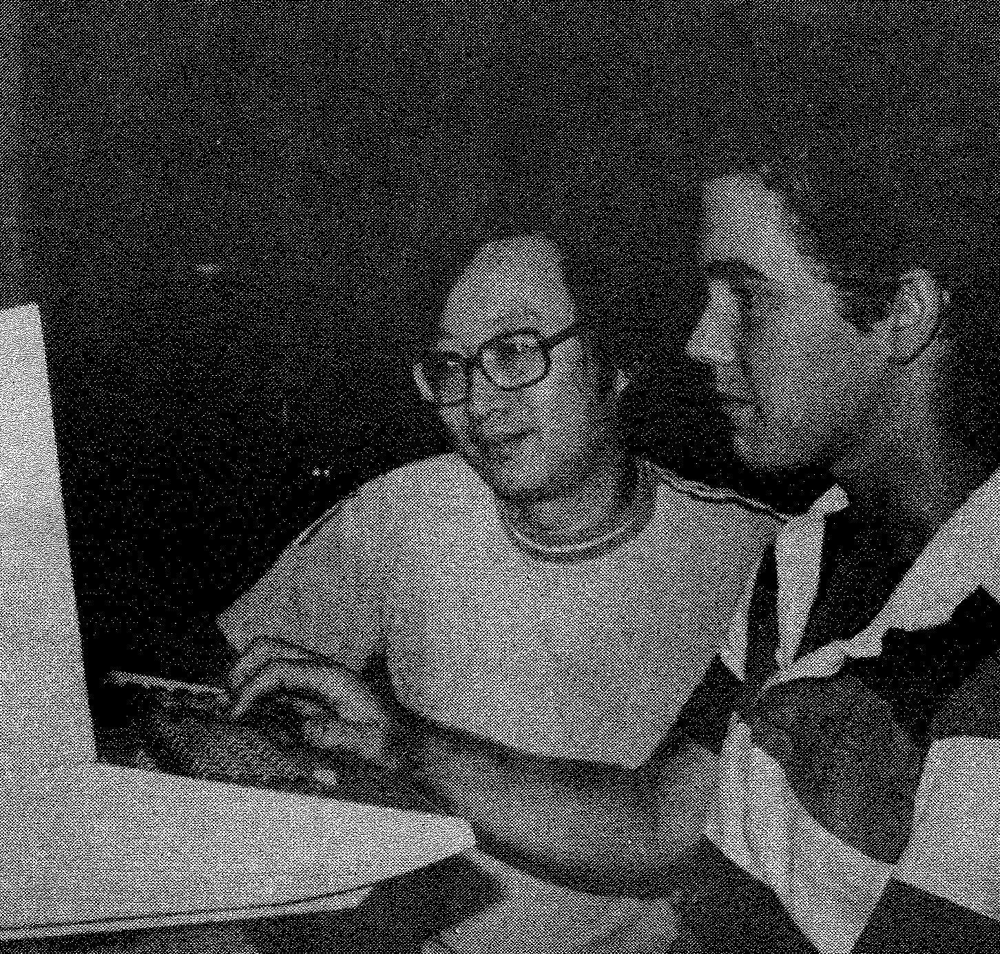 |
| 1982 | Fall	| Fin 104	Bus Forecasting	3			A | |
| 1982 | Fall	| Math 121	Numerical Anl 1	3			A	* Math Coding w/ Fortran 77/ Kafka | |
| 1982 | Fall	| Spch 3	Fund Public Comm	3			A / Champagne Talk (Will Wait) | |

**Portion of The Fresno Assembly Center??** 
|  |  |
|--|--|
| 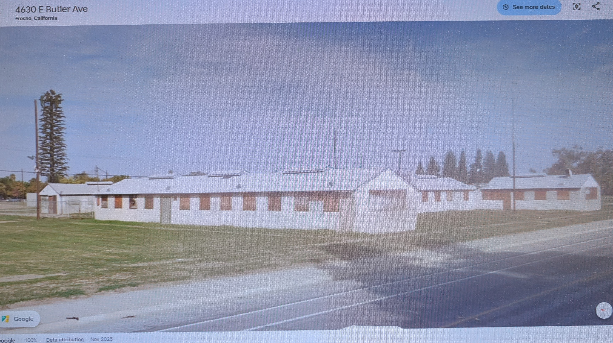 |  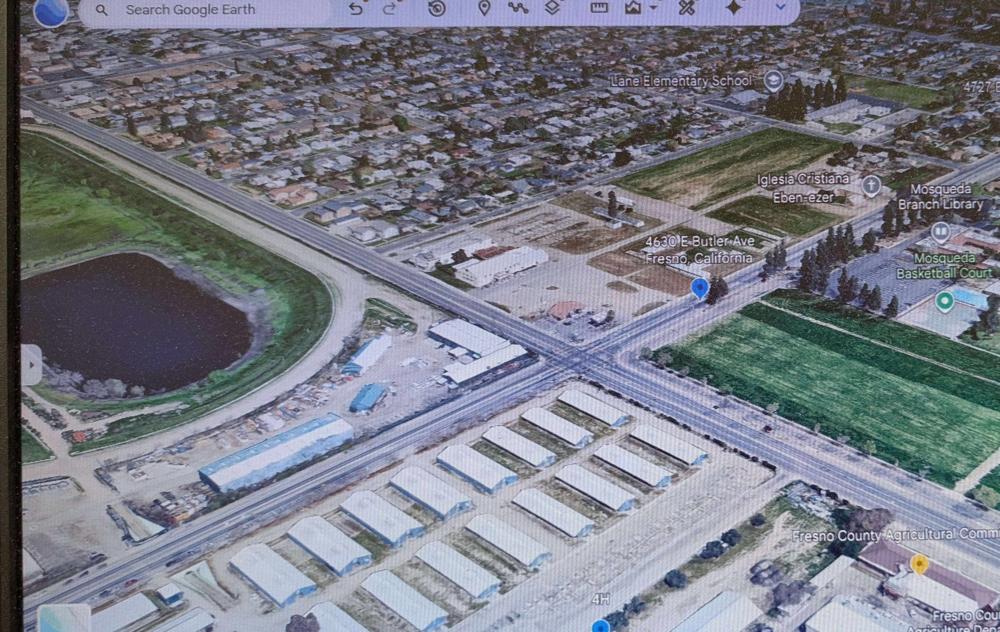|

# Fresno Fair Grounds & Fresno Assembly Center
## 3. Federal Takeover During World War II

The federal government temporarily acquired or leased the fairgrounds and neighboring land in **February 1942**.

This wartime property was larger than the land most residents now identify as the Fresno Fairgrounds. Later federal records associate the former military installation with land now divided among:

* The modern Fresno Fairgrounds
* City-owned property around the Mosqueda Community Center
* Privately owned parcels
* Other developed neighborhood property

This wider wartime boundary is important when considering the former barracks tract near Maple and Butler avenues.

## 4. The Fresno Assembly Center, 1942

Following Executive Order 9066, the fairgrounds and adjacent land became the **Fresno Assembly Center**, one of the temporary detention camps used to imprison Japanese Americans before transferring them to more permanent concentration camps.

The center operated from **May 6 through October 30, 1942**. It confined a total of **5,344 Japanese Americans**, with a peak population of 5,120.

The prisoners primarily came from:

* Fresno County
* Other Central San Joaquin Valley communities
* Amador County

They were imprisoned on the basis of ancestry, without individual charges, trials, or findings of disloyalty.

The camp was surrounded by fencing and guarded by military police. Existing fair buildings were adapted for administrative, medical, storage, and communal purposes, while large numbers of temporary barracks were erected.


|[Dark Chambers (Atari 2600 circa 1988) w/ Gymnasium](https://github.com/everestso/AI-Education/blob/main/DarkChambers_DeepLearning_DRuby.ipynb)  | Castle Wolfenstein (1981)  |
|--|--|
| <a href="darkchambers_best.gif"> 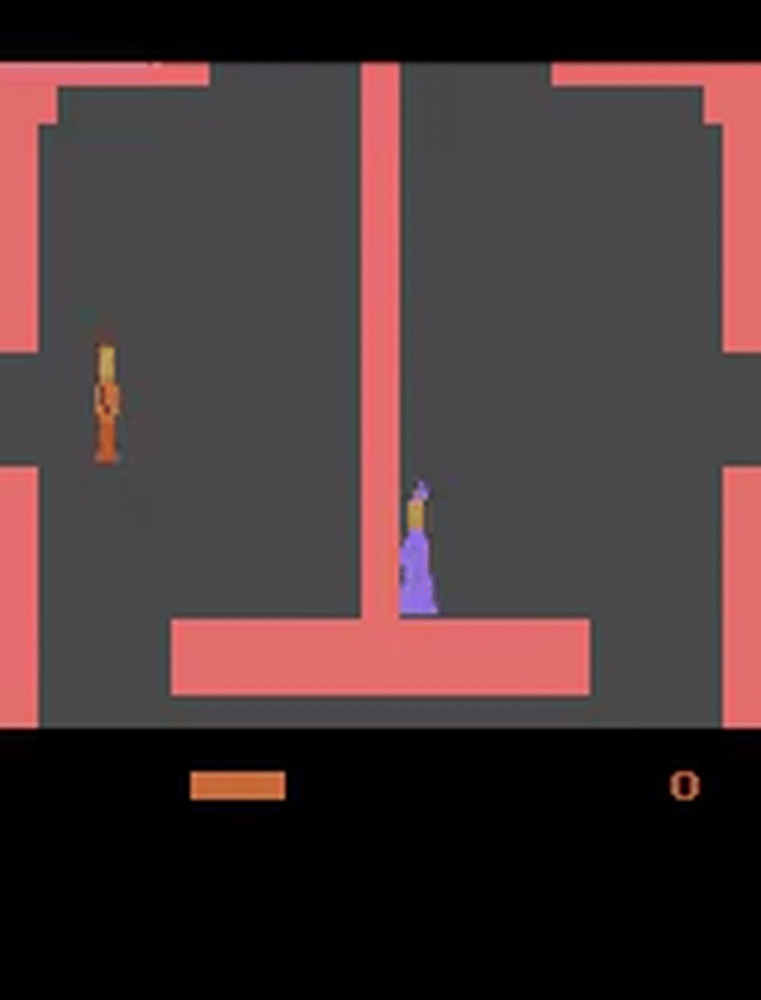 </a> | 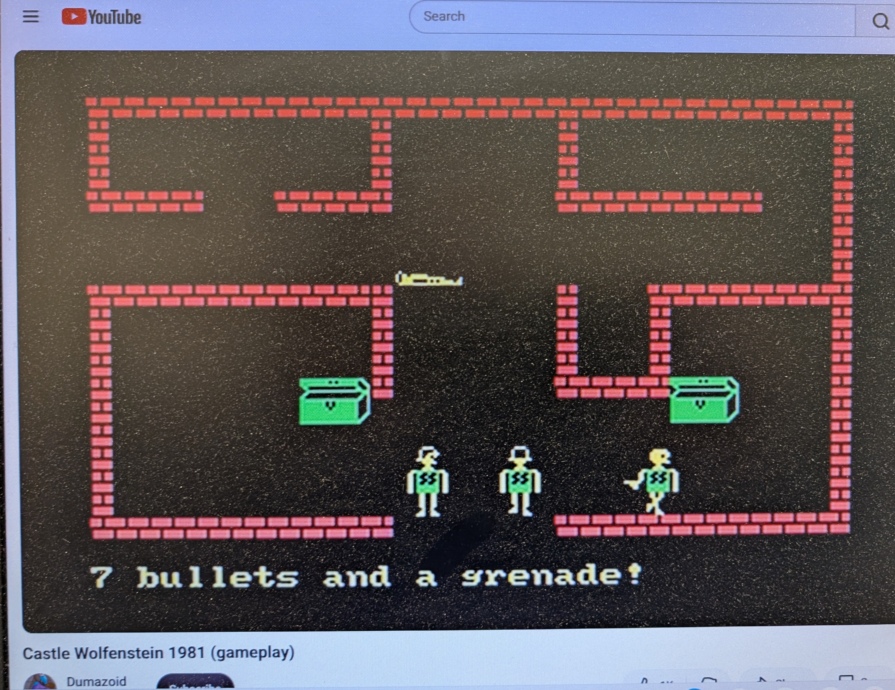</a> |

[Dark Chambers (mp4) Video Highlights](DarkChambers_VideoHighlight.mp4)

# A Brief History of Feminism Through Global Cultural Narratives

Modern feminism developed from movements for **women's legal, political, educational, and economic equality**, then expanded into a broader exploration of **gender roles, identity, power, family, work, sexuality, and social expectations**.

Over time, feminist ideas moved beyond a single Western framework and became increasingly **international**, with each society interpreting gender questions through its own history, religion, class structure, family system, and political culture.

---

## 1. First-Wave Feminism: Legal and Political Equality

The first major phase of modern feminism emerged during the **19th and early 20th centuries**.

Its central concerns included:

* Property rights
* Access to education
* Marriage and inheritance law
* Employment
* Women's suffrage

The basic argument was straightforward:

> **Women should possess the same basic legal and political rights as men.**

This phase focused primarily on formal equality before the law.

---

## 2. Second-Wave Feminism: Society, Family, and Gender Roles

From roughly the **1960s through the 1980s**, feminism expanded beyond voting and legal rights.

It examined:

* Marriage
* Motherhood
* Workplace inequality
* Sexuality
* Reproductive autonomy
* Domestic violence
* Social expectations surrounding femininity

The central question became:

> **Even when women possess legal equality, do social institutions still constrain their choices?**

This period helped establish **Women's Studies** as an academic discipline.

---

## 3. Gender Studies and the Expansion of the Question

By the **1980s and 1990s**, Women's Studies increasingly broadened into **Gender Studies**.

Researchers began examining not only women, but also:

* Masculinity
* Gender identity
* Sexual orientation
* Family structures
* Media representation
* The interaction of gender with race, ethnicity, class, and religion

The discussion therefore moved from:

> **"What rights should women have?"**

toward:

> **"How do societies construct and enforce gender expectations?"**

---

# Feminism as a Global Cultural Conversation

By the late 20th and early 21st centuries, feminist ideas became increasingly international.

Film, television, literature, universities, social media, and global activism allowed different societies to exchange ideas about:

* Women's independence
* Violence against women
* Professional authority
* Family expectations
* Sexuality
* Emotional autonomy
* Gender identity

The result is not one universal form of feminism.

Instead:

> **Global feminism provides shared questions, while different cultures provide different answers.**

---

# Cultural Examples

## *La Femme Nikita* — France

The French film ***La Femme Nikita*** (1990) helped popularize the modern image of the physically capable, psychologically complex female action protagonist.

Nikita is:

* independent,
* dangerous,
* emotionally vulnerable,
* capable of surviving within violent male institutions.

She helped establish an international archetype of the **female operative or fighter** whose competence does not erase her emotional complexity.

---

## *The Girl with the Dragon Tattoo* — Sweden

Lisbeth Salander represents another evolution of the archetype.

She is:

* technologically brilliant,
* socially unconventional,
* deeply suspicious of authority,
* physically capable,
* and fiercely resistant to abuse.

Her character reflects Scandinavian concerns with:

* institutional failure,
* sexual violence,
* personal autonomy,
* and the ability of marginalized individuals to challenge powerful systems.

She became an internationally influential model for the **female hacker-outsider** character.

---

## *The Graveyard* (*Mezarlık*) — Turkey

Turkey's *The Graveyard* places a woman in command of a special police unit investigating violence against women.

The series explores:

* Femicide
* Institutional prejudice
* Female professional authority
* Male-dominated institutions
* Social expectations surrounding women

Its female characters—including investigators and technically skilled outsiders—participate in the global tradition of strong female protagonists while remaining embedded in specifically Turkish social questions.

The central issue is not simply:

> **"Can a woman behave like a man?"**

but rather:

> **"How can women exercise authority and independence while navigating the structures of contemporary Turkish society?"**

---

## *The Olive Tree* (*Zeytin Ağacı / Another Self*) — Turkey

*The Olive Tree* approaches gender from a more psychological and relational direction.

Its female protagonists are:

* educated,
* professionally accomplished,
* emotionally complex,
* deeply connected to family and friendship.

The series explores tension between:

* independence and family obligation,
* science and spirituality,
* individual healing and inherited family patterns.

Its Turkish title, **"The Olive Tree,"** emphasizes roots, ancestry, and continuity.

Its English title, **"Another Self,"** emphasizes individual transformation.

Together, they illustrate how modern feminism can involve not only resistance to institutions but also the effort to reconcile **personal autonomy with family and cultural belonging**.

---

## Sarah Winchester — United States

Sarah Winchester provides an interesting historical contrast.

As a wealthy widow in the late 19th and early 20th centuries, she possessed an unusual degree of:

* financial independence,
* property ownership,
* personal autonomy.

Her life also became surrounded by myths portraying her as:

* eccentric,
* irrational,
* haunted,
* psychologically unstable.

A modern gender-oriented interpretation might ask:

> **Would an independently wealthy man who spent decades redesigning and expanding an enormous estate have been described in quite the same way?**

Her story therefore provides an example of how historical narratives about women can be shaped by cultural expectations about appropriate female behavior.

---

## *The Closer* and *Major Crimes* — United States

American television series such as ***The Closer*** and ***Major Crimes*** explore another major feminist theme:

> **Women exercising institutional authority.**

Brenda Leigh Johnson in *The Closer* and Sharon Raydor in *Major Crimes* command major police units while navigating:

* male colleagues,
* bureaucratic politics,
* professional competition,
* family relationships,
* and public expectations.

These characters represent a different form of feminist protagonist.

Their primary power is not physical combat.

It is:

* intelligence,
* leadership,
* interrogation,
* institutional competence,
* emotional judgment.

They illustrate the normalization of women occupying positions of authority that earlier television frequently reserved for male characters.

---

# Evolution of the Female Protagonist

These characters illustrate how feminist representation has expanded over time.

| Cultural Example              | Form of Female Power                                          |
| ----------------------------- | ------------------------------------------------------------- |
| Sarah Winchester              | Economic and personal independence                            |
| *La Femme Nikita*             | Physical capability and survival                              |
| *Girl with the Dragon Tattoo* | Technical intelligence and resistance                         |
| *The Closer / Major Crimes*   | Institutional authority and leadership                        |
| *The Olive Tree*              | Psychological autonomy and self-understanding                 |
| *The Graveyard*               | Institutional reform and resistance to violence against women |

The modern female protagonist can therefore be:

* leader,
* physician,
* hacker,
* detective,
* fighter,
* mother,
* executive,
* outsider,
* or social reformer.

---

# From Western Feminism to Global Feminism

Historically, many foundational feminist movements developed in Europe and North America.

But contemporary feminism has become much more international.

Today, ideas move between:

* Europe
* Turkey
* Scandinavia
* Latin America
* South Asia
* East Asia
* Africa
* the Middle East
* North America

The influence is increasingly **two-way**.

Turkish television reaches American audiences.

Scandinavian crime fiction influences global television.

French action cinema influences American and Asian productions.

American police dramas influence international crime series.

Local cultures then reinterpret those ideas according to their own social realities.

---

# Historical Perspective

The evolution of feminism can therefore be summarized as a widening series of questions:

```text
Legal Equality
      ↓
Political Participation
      ↓
Economic Opportunity
      ↓
Family and Social Roles
      ↓
Sexuality and Identity
      ↓
Violence and Institutional Power
      ↓
Global Gender and Cultural Context
```

Modern feminism and gender studies increasingly examine how **biology, identity, family, institutions, culture, and power interact**.

The central question is no longer simply whether women should have equal rights.

It has become:

> **How do different societies define gender, distribute authority, construct expectations, and allow individuals to negotiate identity within those structures?**

Film and television provide particularly rich ways of exploring these questions because they allow different cultures to create their own versions of the independent, resistant, emotionally complex, and socially engaged modern woman.

# History of the Fresno Fairgrounds

The history of the Fresno Fairgrounds is more complicated than simply “a fairground that became an internment camp.” It passed through several distinct periods: a privately financed racetrack, a county agricultural fair, a federal detention site, a large Army Air Forces training center, and finally the modern state-managed fairgrounds.

An important distinction is that the **historic fairgrounds, the 1942 Fresno Assembly Center, and the later military installation did not always have identical boundaries**. Wartime operations extended onto adjoining property that is now privately or municipally owned.

## 1. Origins as a Private Racetrack, 1883–1895

The story began in **February 1883**, when local businessmen, growers, and ranchers organized the **Fresno Fair Grounds Association**.

Its original directors included:

* Dr. Lewis Leach
* M. I. Donahou
* Frederick A. Woodworth
* A. B. Butler
* Thomas E. Hughes

The association sold stock and purchased land from **Thomas E. Hughes & Sons**. Hughes was a prominent real-estate developer and civic promoter sometimes described as one of the “fathers” of early Fresno.

The first major improvement was a horse-racing track. The association joined the National Trotting Association, and races were held there by May 1884.

The first Fresno Fair opened in **October 1884**. It was initially a relatively modest agricultural gathering consisting of:

* Five days of horse racing
* Produce displays
* Livestock exhibitions
* Agricultural competitions
* Social and commercial activities

At first, the property was primarily a racetrack. A grandstand and exhibition pavilion were added in **1888**.

Horse racing was therefore not a later addition to the Fresno Fair—it was one of the reasons the fairgrounds was created.

Financial difficulties associated with the economic depression of the 1890s caused the original fair organization to fail. By **1895**, the property had entered foreclosure, and regular fairs ceased.

## 2. County Ownership and Revival, 1901–1941

Fresno County purchased the fairgrounds property in **1901 for approximately $30,000**. The purchase preserved the site, but the fair did not immediately become an annual, financially stable institution.

Community organizations—including banks, churches, merchants, agricultural interests, and the Fresno Chamber of Commerce—eventually pressured county officials to improve the grounds.

Regular fair activity was successfully revived around **1910**. Important improvements followed:

* An agricultural exhibition building opened in 1911.
* An industrial exhibition building opened in 1912.
* The racetrack and grandstand continued to be major attractions.
* Agricultural machinery, livestock, produce, and manufactured goods became central exhibits.

The fair increasingly functioned as a public showcase for the economic identity of the Central Valley. It connected farmers, ranchers, merchants, manufacturers, families, and civic organizations in a setting that combined education with entertainment.

The fair remained at substantially the same southeast Fresno location, although its precise property boundaries and adjoining uses changed over time.

## 3. Federal Takeover During World War II

The federal government temporarily acquired or leased the fairgrounds and neighboring land in **February 1942**.

This wartime property was larger than the land most residents now identify as the Fresno Fairgrounds. Later federal records associate the former military installation with land now divided among:

* The modern Fresno Fairgrounds
* City-owned property around the Mosqueda Community Center
* Privately owned parcels
* Other developed neighborhood property

This wider wartime boundary is important when considering the former barracks tract near Maple and Butler avenues.

## 4. The Fresno Assembly Center, 1942

Following Executive Order 9066, the fairgrounds and adjacent land became the **Fresno Assembly Center**, one of the temporary detention camps used to imprison Japanese Americans before transferring them to more permanent concentration camps.

The center operated from **May 6 through October 30, 1942**. It confined a total of **5,344 Japanese Americans**, with a peak population of 5,120.

The prisoners primarily came from:

* Fresno County
* Other Central San Joaquin Valley communities
* Amador County

They were imprisoned on the basis of ancestry, without individual charges, trials, or findings of disloyalty.

The camp was surrounded by fencing and guarded by military police. Existing fair buildings were adapted for administrative, medical, storage, and communal purposes, while large numbers of temporary barracks were erected.

## 5. The Geography of the Detention Center

The 1942 detention center was not confined solely to the present racetrack enclosure.

Historical sources describe:

* More than 100 barracks inside the racetrack infield
* Additional barracks blocks on adjoining land
* Communal mess halls, toilets, showers, and laundries
* Administrative and military-police facilities
* Recreational spaces
* Fencing and controlled entrances

Butler Avenue passed through the larger detention area and was closed to ordinary traffic while the camp operated.

Local neighborhood history also identifies barracks on property:

* East of Maple Avenue
* North of Butler Avenue
* West of Sierra Vista Avenue
* South of Liberty Avenue
* Near the present address of 4675 East Butler Avenue

This was the Butler-facing portion of the block immediately east of the fairgrounds racetrack. It was close to—but separate from—the property later occupied by the Mayfair and Fine Art Theatre.

The modern street grid and property divisions can therefore be misleading. Land outside today’s fairgrounds fence could still have been part of the larger 1942 detention and military landscape.

## 6. Conditions in the Barracks

Most living quarters were hastily built, wood-frame military barracks. Interior spaces were divided into small family rooms, often with partitions that did not reach the roof.

Prisoners endured:

* Little privacy
* Communal toilets and showers
* Sparse furnishings
* Dust and inadequate insulation
* Few shade trees
* Extreme summer temperatures
* Tar-paper and lightly constructed surfaces that intensified the heat

The camp remained open for 177 days, making it one of the longest-operating temporary assembly centers and the last one to close.

Nearly all its prisoners were transferred to the **Jerome concentration camp in Arkansas**. A smaller group, including people suffering from tuberculosis and members of their families, was sent to Gila River, Arizona.

## 7. The Army Air Forces Training Center, 1942–1946

After the prisoners were removed, the federal government converted the site into **Army Air Forces Basic Training Center No. 8**.

This was not principally a flying field. It was a ground-training and processing installation where newly inducted Army Air Forces personnel received:

* Military orientation
* Classification and assignment
* Physical conditioning
* Basic military instruction
* Preparation for specialized technical or flight-related training elsewhere

The larger installation reportedly reached approximately **300 acres**, substantially exceeding the modern fairgrounds footprint. Barracks and other infrastructure inherited from the detention center were likely useful during this transition, although individual buildings require separate documentation.

The Army Air Forces Training Command became active at the site in July 1943. The training center finally closed on **February 13, 1946**.

This wider military footprint helps explain why wartime structures, utility installations, and community memories survived on parcels outside today’s fairgrounds.

## 8. The Yellow Siren and the Military Landscape

The yellow siren pole remembered near the Butler and Maple area may belong to this broader wartime or postwar history, but its installation date has not been established.

Possible origins include:

* A World War II air-raid warning system
* An alarm serving the Army Air Forces training center
* A postwar Cold War civil-defense network
* A municipal fire or emergency-warning system
* An operational alarm connected with the fairgrounds

Outdoor sirens became widespread during World War II and the Cold War. They were regularly tested through community drills and could use different sound patterns for an alert, attack warning, or other emergency.

Yellow was a common color for some sirens and poles because it was highly visible and made public-safety equipment easier to recognize and maintain. Several prominent Cold War siren models were frequently painted yellow or mustard. The color was not, however, a nationally standardized indication of purpose.

The pole’s location near the former military property is significant, but it cannot by itself prove that the siren was associated with the 1942 detention center. A Cold War origin may be equally—or more—likely.

## 9. Postwar Return of the Fair, 1948–1950s

The Army left the property in poor condition. The annual fair resumed in **1948** under the leadership of Tom Dodge and the state’s **21st District Agricultural Association**.

This marked an important administrative transition. Although Fresno County continued to own much of the property, the fair became part of California’s system of district agricultural associations.

Postwar reconstruction required extensive work:

* Military facilities had to be removed or converted.
* Fair buildings required repair.
* The grounds had to be reorganized for civilian use.
* Agricultural and industrial exhibition spaces had to be restored.

By 1953, the old agricultural and industrial exhibition buildings were considered too expensive to rehabilitate and were demolished. New facilities replaced them.

The nearby **Mayfair Theatre opened in 1947**, during this same period of demobilization and neighborhood redevelopment. It became the Fine Art Theatre in 1961.

## 10. Expansion into a Regional Institution

During the postwar decades, the fairgrounds developed into one of the Central Valley’s largest public event complexes.

Horse racing remained central, but the fair expanded to include:

* Major concerts
* Carnival rides
* Agricultural education
* Livestock competitions
* Industrial and commercial exhibits
* Youth and 4-H programs
* Community performances
* Food and cultural events

Attendance reached approximately **460,100 in 1972**, then considered a record. The grandstand and Paul Paul Theater were expanded before the 1979 fair.

The grounds increasingly functioned year-round rather than only during the October fair.

## 11. Historical Recognition

For decades, the incarceration history received relatively little public recognition. California eventually designated the Fresno Assembly Center as part of **California Historical Landmark No. 934**.

A more extensive memorial was dedicated at the fairgrounds in 2011. It includes names, photographs, and personal accounts connected with the more than 5,000 people confined there.

The memorial is near the **Chance Avenue entrance**. It explicitly recognizes that the prisoners were detained without charges, trial, or establishment of guilt.

The fairgrounds later developed two historical museums:

* The Big Fresno Fair Museum, opened in 2012
* The Fresno County Historical Museum, opened in 2015

The latter is a two-story, 14,000-square-foot museum containing exhibits on the broader history of Fresno County.

## 12. The Fairgrounds Today

The present Fresno Fairgrounds encompasses approximately **165 acres** and is operated by the **21st District Agricultural Association**, an entity within the California Department of Food and Agriculture.

In addition to the annual Big Fresno Fair, the site hosts hundreds of activities throughout the year, including:

* Cultural celebrations
* Trade and consumer shows
* Flea markets
* Banquets and weddings
* Agricultural programs
* Concerts and community events
* Satellite horse-race wagering
* Historical museum programs

The current fairgrounds represents only one part of the property’s historical geography. The 1942 detention center and subsequent Army installation extended into surrounding areas that are now separated by streets, fences, ownership, and later development.

## Historical Timeline

| Period           | Principal use                                             |
| ---------------- | --------------------------------------------------------- |
| 1883             | Fresno Fair Grounds Association organized                 |
| 1884             | First races and first Fresno Fair                         |
| 1888             | Grandstand and exhibition pavilion added                  |
| 1895             | Original organization failed during economic depression   |
| 1901             | Fresno County purchased the property                      |
| Circa 1910       | Regular agricultural fair revived                         |
| 1911–1912        | Agricultural and industrial buildings constructed         |
| May–October 1942 | Fresno Assembly Center confined Japanese Americans        |
| Late 1942–1946   | Army Air Forces Basic Training Center No. 8               |
| 1948             | Agricultural fair resumed under state district management |
| 1950s            | Major demolition and postwar reconstruction               |
| 1970s onward     | Expansion as a regional entertainment complex             |
| 2011             | Fresno Assembly Center memorial dedicated                 |
| 2012–2015        | Fair and county historical museums established            |
| Present          | Annual fair and year-round public-event center            |

## Overall Interpretation

The Fresno Fairgrounds is not simply an entertainment venue. Its history reflects the development of Fresno itself:

1. **Agricultural capitalism and horse racing** shaped its origins.
2. **County ownership and civic investment** turned it into a regional institution.
3. **Japanese American incarceration** made it part of one of the gravest civil-rights violations in American history.
4. **Army Air Forces occupation** expanded the site into surrounding neighborhoods.
5. **Postwar redevelopment** produced the fairgrounds and nearby commercial district remembered today.
6. **Historical memorialization** has gradually restored the incarceration story to public view.

The surviving neighborhood memories—barracks near Maple and Butler, military buildings, and the yellow siren pole—fit within this larger history. They may preserve details that official accounts, focused narrowly on the current fairgrounds property, have overlooked.

## References

1. The Big Fresno Fair, [“Our Story”](https://www.fresnofair.com/p/about-us/our-story), describing the fair’s 1884 foundation, continuing location, administration, and present operations.

2. U.S. Army Corps of Engineers, [Formerly Used Defense Site record for the Fresno Army Air Forces Training Center](https://geospatial.sec.usace.army.mil/server/rest/services/Military/FUDS_Data/MapServer/1/8650), documenting the federal lease, Japanese American detention site, Army training mission, and later division of the property among state, municipal, and private owners.

3. National Park Service, [*Confinement and Ethnicity: Assembly Centers*](https://www.npshistory.com/series/anthropology/wacc/74/chap16.htm), documenting the Fresno Assembly Center’s population, barracks, conditions, and dates of operation.

4. Smithsonian National Museum of American History, [“Map of Fresno Assembly Center”](https://americanhistory.si.edu/collections/object/nmah_1295205), a camp plan dated June 3, 1942.

5. California State Parks, [“Temporary Detention Camps for Japanese Americans—Fresno Assembly Center”](https://ohp.parks.ca.gov/ListedResources/Detail/934), the official California Historical Landmark record.

6. Densho, [“Thieving Guards, Mass Food Poisoning, and Other Facts of Life in Fresno Assembly Center”](https://densho.org/catalyst/facts-of-life-in-fresno-assembly-center/), presenting documentary research and personal accounts of daily life in the camp.

7. The Big Fresno Fair, [“Fresno County Historical Museum”](https://www.fresnofair.com/p/education/museums/fresno-county-historical-museum), describing the museum and its historical collections.

> **Source note:** The general institutional and wartime history is well documented. Exact boundaries of the barracks near East Butler Avenue—and the date and purpose of the remembered yellow siren—would require comparison of the 1942 camp plan with historic aerial photographs, assessor maps, military records, and neighborhood oral histories.

# The Fine Art Theatre Neighborhood and the Fresno Assembly Center

Stories connecting the neighborhood around Fresno’s Fine Art Theatre with World War II barracks have a strong historical foundation. The barracks were **not located on the Fine Art Theatre property itself**, however. They stood on an adjacent but separate tract east of Maple Avenue and north of Butler.

More precisely, the remembered property occupied the **Butler-facing, southern portion of the block bounded by Butler Avenue, Maple Avenue, Sierra Vista Avenue, and Liberty Avenue**. It was outside what residents now ordinarily recognize as the Fresno Fairgrounds, but directly adjacent to the fairgrounds and across Maple Avenue from the racetrack area.

## The Fresno Assembly Center

Following Executive Order 9066, the Fresno County Fairgrounds and nearby land were converted into the **Fresno Assembly Center**, a temporary detention camp for Japanese Americans.

The center operated from **May 6 through October 30, 1942**. During that period, it confined a total of **5,344 Japanese Americans**, with a peak population of 5,120. Most came from Fresno and other Central San Joaquin Valley communities, together with families from Amador County. They were imprisoned without individual charges or trials.

Although officially called an *assembly center*, it was a guarded detention facility surrounded by fencing and patrolled by military police.

## Location of the Nearby Barracks

The wartime center extended beyond the boundaries most people currently associate with the Fresno Fairgrounds. Barracks and communal buildings were constructed both within the racetrack area and on adjoining property.

The neighborhood tract associated with the Fine Art Theatre stories was:

* **East of Maple Avenue**
* **North of Butler Avenue**
* **West of Sierra Vista Avenue**
* **South of Liberty Avenue**
* Concentrated along the **southern, Butler Avenue side of that block**

This property was close to the Fine Art Theatre but was not the theater parcel. It also stood separately from the present-day fairgrounds, across Maple Avenue from the racetrack.

The camp barracks were hastily constructed wood-frame buildings. Families lived in small rooms separated by partitions that did not extend completely to the roof. Toilets, showers, laundries, and dining halls were communal. Lightweight construction, minimal insulation, tar-paper surfaces, and little shade made the buildings especially uncomfortable during Fresno’s summer heat.

## Relationship to the Fine Art Theatre

The **Mayfair Theatre**, later renamed the **Fine Art Theatre**, stood nearby on Maple Avenue but occupied a different property.

The distinction is important:

* The theater was **not itself an incarceration barracks**.
* The theater parcel was separate from the remembered barracks property.
* The barracks tract was east of Maple and north of Butler.
* The Mayfair Theatre did not open until **July 17, 1947**, almost five years after the assembly center closed.

Because the theater became one of the neighborhood’s most recognizable landmarks, former residents naturally used it as a reference point when describing the barracks. Over time, the phrase “the barracks near the Fine Art” may have been shortened or misremembered as “the barracks on the Fine Art property.”

## Military Use After the Assembly Center

When the Fresno Assembly Center closed in October 1942, most of its prisoners were transported to the **Jerome concentration camp in Arkansas**. A smaller group, including tuberculosis patients and their families, was sent to Gila River, Arizona.

The fairgrounds and surrounding facilities were then used by the **Army Air Forces Basic Training Center No. 8**. Military use continued until early 1946. The area therefore passed through two related wartime phases:

1. The incarceration of Japanese Americans in 1942.
2. Army Air Forces training and support operations from 1942 to 1946.

The Mayfair Theatre opened the following year, as the neighborhood transitioned from wartime military use to postwar commercial and residential development.

## The Yellow Siren Pole

A distinctive **yellow siren pole** remained near the former barracks property for many years. Its presence became another part of the neighborhood’s remembered connection to wartime and civil-defense activity.

Outdoor warning sirens became common in American communities during World War II. They were initially intended to warn residents of approaching air raids and could also signal blackout procedures or other emergencies. During the Cold War, many communities expanded or replaced these systems to provide warnings of possible nuclear attack.

Depending on local arrangements, sirens could be used for:

* Air-raid or civil-defense warnings
* Scheduled community preparedness drills
* Nuclear-attack exercises during the Cold War
* Major fires or hazardous emergencies
* Summoning volunteer emergency personnel
* Operational warnings at public or military facilities

Different sound patterns could communicate different instructions. A steady tone commonly served as an *alert*, while a rising-and-falling tone was often associated with an *attack* warning. Sirens were periodically tested so residents and emergency personnel would recognize the signals and officials could verify that the equipment worked.

### What Did the Yellow Color Mean?

Yellow or mustard-colored sirens and supporting poles were common, particularly among some mid-century warning-siren installations. Yellow provided high visibility and made the equipment easier for maintenance crews to identify. Certain well-known Cold War models, including the rotating **Federal Signal Thunderbolt**, were frequently supplied or painted yellow.

The color was **not a universal national code**, however. A yellow pole does not by itself establish:

* Who installed it
* Whether it dated from World War II or the Cold War
* Whether it warned of air raids, fires, or another emergency
* Whether it belonged to the detention center, the Army, the city, or the fairgrounds

Its age and original function would need to be established through photographs, equipment markings, municipal records, or the memories of residents who heard it tested.

## Possible History of the Butler Avenue Siren

Several explanations remain possible:

1. **World War II warning system:** It may have been installed for air-raid alerts or community blackout exercises.

2. **Army Air Forces installation:** It may have served the military training facilities that occupied the fairgrounds after the assembly center closed.

3. **Cold War civil-defense siren:** It may have been installed during the 1950s or 1960s as part of Fresno’s community warning network.

4. **Fire or general emergency siren:** It could have alerted the neighborhood or summoned emergency personnel.

5. **Fairgrounds warning system:** Its proximity to the racetrack and fairgrounds may indicate an operational or emergency-warning purpose connected with those facilities.

The siren’s location near former barracks land is historically suggestive, but it does not prove that the siren was part of the 1942 detention center. Its association with later civil-defense drills may be more likely, particularly if the siren resembled a rotating Cold War model.

Memories of its testing schedule, sound pattern, siren-head shape, control cabinet, or identification plates could help determine its approximate date and purpose.

## Historical Significance of the Area

```text
Fresno fairgrounds and adjacent property
        ↓
Japanese American detention center, 1942
        ↓
Army Air Forces facilities, 1942–1946
        ↓
Postwar neighborhood development
        ↓
Mayfair Theatre, 1947
        ↓
Fine Art Theatre, 1961–1988
```

This small part of southeast Fresno connects several histories that are seldom discussed together: Japanese American incarceration, wartime military activity, Cold War civil defense, and the postwar development of the neighborhood.

The barracks are gone, and their former location is now physically separate from the fairgrounds. Nevertheless, the property east of Maple and north of Butler formed part of the broader wartime landscape. The long-surviving yellow siren pole may have helped preserve community memories that something historically important once occupied the site.

## References

1. National Park Service, [*Confinement and Ethnicity: Assembly Centers*](https://www.npshistory.com/series/anthropology/wacc/74/chap16.htm), documenting the Fresno center’s dates, population, barracks, and communal buildings.

2. Smithsonian National Museum of American History, [“Map of Fresno Assembly Center”](https://americanhistory.si.edu/collections/object/nmah_1295205), a camp plan dated June 3, 1942.

3. Densho, [“Thieving Guards, Mass Food Poisoning, and Other Facts of Life in Fresno Assembly Center”](https://densho.org/catalyst/facts-of-life-in-fresno-assembly-center/), describing the camp’s geography and daily life.

4. California State Parks, [“Temporary Detention Camps for Japanese Americans—Fresno Assembly Center”](https://ohp.parks.ca.gov/ListedResources/Detail/934), the official California Historical Landmark record.

5. ABC30, [“Remembering Historic Events at the Big Fresno Fair”](https://abc30.com/archive/8373602/), featuring survivor memories and the fairgrounds memorial.

6. Cinema Treasures, [“Fine Arts Theatre, Fresno, California”](https://cinematreasures.org/theaters/5117), documenting the nearby Mayfair and Fine Art Theatre.

7. *Los Angeles Times*, [“Silent and Rusting, Sirens Remain as Relic of Red Scare”](https://www.latimes.com/archives/la-xpm-1993-07-05-me-10207-story.html), discussing the survival of yellow and mustard-colored Cold War sirens in California.

> **Historical note:** The barracks and the Fresno Assembly Center are documented. The more precise identification of the property reflects neighborhood geographic memory and should be verified against the 1942 camp map and historical parcel records. The yellow pole’s civil-defense function is plausible, but its date and relationship to the detention center have not been confirmed.

# The Fine Art Theatre on Maple Avenue

The **Fine Art Theatre**, located at **1225 South Maple Avenue near the Fresno Fairgrounds**, had several distinct lives and occupies an unusual place in Fresno’s cultural history.

## From Neighborhood Theater to Art House

The theater opened as the **Mayfair Theatre on July 17, 1947**. Operated by the San Francisco–based Westland Theatres chain, it was a single-screen neighborhood cinema designed in the **Streamline Moderne** style.

During the 1950s, the Mayfair primarily presented **second-run double features**—films that had completed their initial engagements at Fresno’s downtown theaters. Former patrons remember weekend children’s programs, stage contests, and prizes obtained by exchanging collected soda-bottle caps.

The Mayfair was reportedly outside Fresno’s city limits at the time, allowing patrons to smoke inside. This distinguished it from theaters within the city, where smoking was restricted.

For a period, the building was also known as the **International Theatre**, although the dates and programming associated with this name are not well documented.

## The Fine Art Years

The theater reopened as the **Fine Art Theatre on December 25, 1961**. Its new name reflected a major change in programming: it became Fresno’s principal venue for foreign, independent, experimental, and other nonmainstream films.

Patrons recall seeing films by directors such as:

* **Ingmar Bergman**
* **Federico Fellini**
* **Akira Kurosawa**
* **Andy Warhol** and other underground filmmakers

The Fine Art cultivated a deliberately cosmopolitan atmosphere. According to local recollections, it offered imported chocolates and complimentary coffee rather than relying entirely on conventional theater concessions. Advertisements also promoted **“Free Supervised Parking,”** probably intended to reassure audiences traveling to its southeast Fresno location.

Before home video and the expansion of university film programs, theaters like the Fine Art provided one of the few opportunities for Fresno audiences to encounter European modernism, Japanese cinema, experimental filmmaking, and movies dealing openly with sexuality or political dissent.

Its proximity to the **Fresno Community Theater** also helped make the area a small, if now largely forgotten, cultural destination.

## From Erotic Cinema to Closure

As American film censorship weakened during the late 1960s, the boundary between the “art film” and the “adult film” became increasingly uncertain. European films promoted for their artistic sophistication were also frequently advertised through their sexual content.

The Fine Art gradually began showing more exploitation pictures, sex comedies, soft-core films, and eventually explicit pornography. This transition occurred at many independent art houses as television, suburban multiplexes, and changing film-distribution practices reduced their traditional audiences.

The Fine Art Theatre finally closed in **1988**.

The property is now classified in commercial records as supermarket or retail land, and the theater is no longer operating. Available online records do not clearly establish when the original auditorium was demolished or incorporated into later development.

## Historical Significance

The Fine Art’s history reflects three overlapping periods of American moviegoing:

1. **The postwar neighborhood cinema**, represented by the Mayfair Theatre.
2. **The 1960s art-house movement**, which introduced Fresno audiences to international and experimental filmmaking.
3. **The decline of independent single-screen theaters**, many of which survived temporarily by shifting toward erotic and adult programming.

Its final years as an adult theater can overshadow its more important cultural role. For roughly two decades, the Fine Art gave Fresno audiences a cinematic window onto international modernism, underground filmmaking, and the emerging counterculture.

## References

1. Cinema Treasures, [“Fine Arts Theatre, Fresno, California”](https://cinematreasures.org/theaters/5117), including its opening and closing dates, former names, architectural classification, and recollections submitted by former patrons.

2. LoopNet, [property record for 1225 South Maple Avenue](https://www.loopnet.com/property/1225-s-maple-ave-fresno-ca-93702/06019-47030008/), documenting the parcel’s present commercial classification.

> **Source note:** The principal dates are supported by contemporary theater advertisements cited in the Cinema Treasures archive. Details about programming, concessions, smoking, and audience culture come primarily from individual recollections and should be regarded as oral history rather than fully verified institutional records.

## Arabella Huntington: Collector, Philanthropist, and Huntington Library Co-Founder

**Arabella Duval Huntington (c. 1850–1924)** was an influential art collector, investor, and philanthropist whose contributions helped shape the Huntington Library, Art Museum, and Botanical Gardens in San Marino.

### Early Life

Some details of Arabella’s early life remain uncertain. She was probably born in Alabama and raised largely in Richmond, Virginia. After her father’s death, her mother supported the family by operating a boardinghouse.

Arabella moved to New York during the late 1860s and gave birth to her son, **Archer Milton Worsham**, in 1870. Accounts differ over whether she formally married John Archer Worsham, and Archer’s biological paternity has long been debated.

Arabella subsequently formed a close relationship with **Collis P. Huntington**, one of the “Big Four” railroad developers associated with the Central Pacific and Southern Pacific railroads. The relationship may have begun while Collis was still married. After the death of his first wife, Collis married Arabella in 1884 and adopted Archer.

### Marriage to Collis Huntington

Arabella became an accomplished investor and art collector during her marriage to Collis. She purchased real estate and securities and assembled paintings, decorative arts, furniture, jewelry, and antiquities.

After Collis died in 1900, Arabella inherited a substantial fortune and became one of America’s wealthiest women. She expanded her collection to include:

* Dutch and Italian Old Master paintings
* Eighteenth-century French art
* Chinese porcelain
* European furniture and decorative arts
* Medieval and Renaissance religious objects

She competed in the same international art market as collectors such as J. P. Morgan and Henry Clay Frick.

### Marriage to Henry E. Huntington

In 1913, Arabella married Collis’s nephew, **Henry Edwards Huntington**. The marriage attracted considerable public attention because Henry was the nephew of her deceased husband.

Arabella was also related to Henry through his first marriage: Henry’s first wife, Mary Alice Prentice, was the sister of a niece adopted by Collis and his first wife. The Huntington family network was therefore unusually interconnected.

Arabella strongly influenced Henry’s development as an art collector. Her knowledge, taste, and contacts with prominent dealers helped guide his purchases, particularly his celebrated collection of British portraits.

She also took an interest in the gardens and residence at Henry’s San Marino estate, although she continued to spend considerable time in New York and Europe.

### Creating the Huntington

In 1919, Arabella and Henry jointly signed the trust agreement that transformed their private San Marino estate and collections into a public institution dedicated to scholarship, art, gardens, and public welfare.

Arabella died in 1924, three years before Henry. The Huntington opened to the public in 1928.

Her role was subsequently overshadowed by Henry’s name and by the dispersal of much of her personal collection. Some works entered the Metropolitan Museum of Art, the Hispanic Society Museum, San Francisco’s Legion of Honor, and other institutions. Henry also assembled the **Arabella D. Huntington Memorial Art Collection** in her honor.

> Arabella Huntington was not simply the wife of two railroad magnates. She was an important Gilded Age collector whose financial judgment, artistic knowledge, and philanthropy helped create several major American cultural collections.

## References

1. The Huntington, [“Arabella Huntington: ‘Director of the Whole Enterprise’”](https://www.huntington.org/watch-read-listen/verso/arabella-huntington-director-whole-enterprise). A detailed reassessment of Arabella’s career as an investor, collector, philanthropist, and institutional founder.

2. The Huntington, [“Arabella (Yarrington) Huntington”](https://emuseum.huntington.org/people/3267/arabella-yarrington-huntington). Biographical overview of her early life, marriages, collecting, and philanthropy.

3. The Huntington, [“Our Organization”](https://www.huntington.org/about/our-organization). Describes Henry and Arabella’s creation of the public institution through their 1919 trust.

4. Smithsonian Archives of American Art, [“Arabella Duval Huntington Papers, 1888–1925”](https://www.aaa.si.edu/collections/arabella-duval-huntington-papers-9682). Archival collection documenting her art collecting and charitable activities.

## Julia Morgan: Architect of Hearst Castle

**Julia Morgan (1872–1957)** was the pioneering California architect responsible for Hearst Castle at San Simeon. Born in San Francisco and raised in Oakland, she became one of the most accomplished architects in American history and an important figure in the advancement of women within professional life.

Morgan graduated from the University of California, Berkeley, with a degree in civil engineering in 1894. Encouraged by architect Bernard Maybeck, she continued her studies at the prestigious École des Beaux-Arts in Paris. After overcoming repeated gender-based barriers, she became the first woman admitted to its architecture program and the first woman to earn its architectural certificate.

Returning to California, Morgan became the state’s first licensed female architect in 1904 and opened her own San Francisco practice. Her engineering knowledge was particularly valuable in earthquake-prone California. One of her first independent commissions, the reinforced-concrete **El Campanil bell tower at Mills College**, survived the 1906 earthquake and helped establish her professional reputation.

In 1919, newspaper publisher **William Randolph Hearst** hired Morgan to develop his family ranch at San Simeon. Their collaboration continued for nearly three decades. Morgan designed and supervised most aspects of what became Hearst Castle, including:

* The main residence, Casa Grande
* Three guest houses
* The Neptune and Roman pools
* Terraces, gardens, roads, and service buildings
* Structural systems supporting the hilltop complex
* Installation of Hearst’s extensive collection of European art and architectural fragments

Hearst supplied an enormous stream of ideas, historical references, and acquired objects; Morgan translated them into structures that could actually be built. Her combination of artistic imagination, engineering knowledge, and organizational discipline gave architectural unity to a project that could otherwise have become a collection of unrelated extravagances.

Hearst Castle was only one part of her career. Morgan completed more than 700 projects, including private residences, churches, women’s clubs, YWCA buildings, university facilities, and the Asilomar Conference Grounds near Pacific Grove. Approximately 100 of her commissions were designed specifically for women’s organizations.

Although Morgan was not an outspoken feminist activist, her career had a powerful feminist effect. She entered an overwhelmingly male profession, operated her own practice, employed other women, and designed spaces in which women could live, exercise, study, organize, and participate in civic life.

> Julia Morgan advanced women’s independence through the authority of her work. Rather than arguing publicly that women could become great architects, she demonstrated it through hundreds of enduring buildings.

In 2014, Morgan posthumously became the first woman to receive the **American Institute of Architects Gold Medal**, the organization’s highest honor.

## References

1. UC Berkeley Civil and Environmental Engineering, [“Julia Morgan: Academy of Distinguished Alumni”](https://ce.berkeley.edu/people/alumni/academy-of-distinguished-alumni/1504). Overview of Morgan’s education, career, major projects, and work at Hearst Castle.

2. Berkeley News, [“Berkeley’s Julia Morgan Collection Shows Alumna Designed Spaces for Women”](https://news.berkeley.edu/2020/03/30/berkeleys-julia-morgan-collection-shows-alumna-designed-spaces-for-women/). Discusses Morgan’s professional barriers, architectural archive, and extensive work for women’s organizations.

3. Hearst Castle, [“Julia Morgan Tour”](https://hearstcastle.org/tour/julia-morgan-tour/). Official California State Parks overview of Morgan’s career and her work at the San Simeon estate.

4. UC Berkeley Engineering, [“Julia Morgan: Iconic Architect”](https://engineering.berkeley.edu/julia-morgan-iconic-architect/). Brief account of Morgan’s pioneering education, architectural license, and legacy.

## Sarah Winchester as an Early Feminist Figure

Sarah Winchester was not a public feminist activist, but her life can reasonably be interpreted as an early expression of feminist independence. After her husband’s death in 1881, she controlled her own fortune, managed investments and real estate, supported an extended family, and pursued architectural experimentation at a time when finance, property development, and architecture were overwhelmingly controlled by men.[^1]

Her San Jose estate, **Llanada Villa**, became an architectural laboratory. Winchester studied architectural publications, prepared designs, supervised builders, selected materials, and repeatedly modified rooms when the results did not satisfy her. The estate incorporated sophisticated plumbing, heating, elevators, decorative glass, and other advanced features. Some of its present irregularities also resulted from decades of remodeling and damage caused by the 1906 earthquake.[^1]

Sarah shared her architectural interests with her sister Isabel Merriman. The sisters collaborated on **El Sueño**, the Merriman family’s Victorian residence in what is now Los Altos. Similar features in the two houses suggest that their designs reflected a genuine family interest in architecture and woodworking, possibly influenced by their father, Leonard Pardee, who was a skilled carpenter and joiner.[^2]

Winchester also used her wealth philanthropically. She supported relatives and employees, contributed to charitable and conservation projects, and provided substantial funding for a tuberculosis hospital established in memory of her husband. Her financial records suggest that her lasting priority was not endlessly spending her fortune on a mysterious mansion, but preserving enough wealth to support medical care and other beneficiaries.[^1]

Nevertheless, newspapers portrayed Winchester as irrational, reclusive, and possibly haunted. Because she rarely answered reporters or publicly explained her decisions, speculation gradually replaced evidence. After her death, the supernatural narrative became commercially valuable when Llanada Villa was converted into the Winchester Mystery House.

The treatment of Winchester reveals a clear gendered double standard. Activities that might have made a wealthy man appear inventive or visionary—directing construction, experimenting with technology, managing investments, and protecting his privacy—were used to characterize Winchester as unstable.

> Sarah Winchester’s historical importance lies partly in the contrast between the life she lived and the legend imposed upon her: an independent woman practicing architecture, managing wealth, and supporting philanthropy was transformed by a patriarchal culture into a “mad widow” frightened by ghosts.

The historical record cannot reveal all of Winchester’s private beliefs, and it would be anachronistic to declare her a feminist activist without qualification. But she lived with a degree of financial, intellectual, and creative independence rarely available to women of her generation. Seen in that context, the Winchester Mystery House represents not only architectural eccentricity, but also the difficulty American society had in understanding a woman who exercised authority outside conventional domestic roles.

## References

1. Mary Jo Ignoffo, *Captive of the Labyrinth: Sarah L. Winchester, Heiress to the Rifle Fortune*, revised and updated edition (University of Missouri Press, 2022). [Publisher’s overview](https://www.penguinrandomhouse.com/books/554887/captive-of-the-labyrinth-by-mary-jo-ignoffo/)

2. Los Altos History Museum, [“Museum Talk Reveals Insights into Winchester and Merriman Homes”](https://www.losaltoshistory.org/2025/09/museum-talk-reveals-insights-into-winchester-and-merriman-homes/). Discusses the architectural relationship between Sarah Winchester’s Llanada Villa and Isabel Merriman’s El Sueño.


# Mills College and the Evolution of Bay Area Feminism

Mills College occupied an important and evolving position in California feminism. Founded in 1852 as the Young Ladies’ Seminary and relocated to Oakland in 1871, Mills began with the nineteenth-century claim that women possessed the intellectual and moral capacity for advanced education.

Over time, that commitment expanded into support for professional independence, feminist scholarship, lesbian and queer community, racial inclusion, sexual autonomy, and transgender recognition.

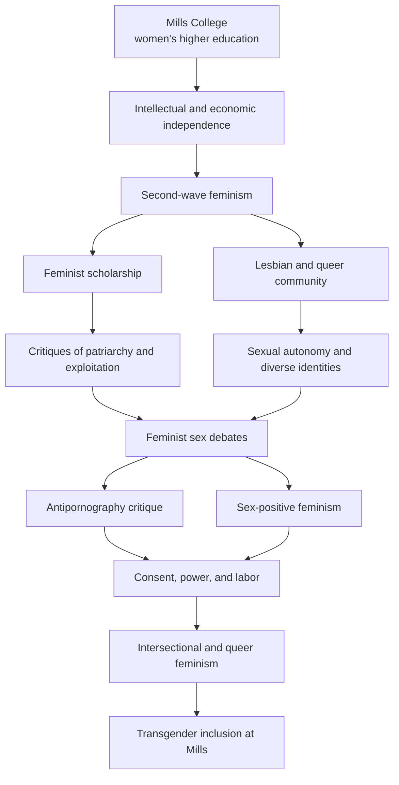

## From Women’s Education to Feminist Independence

Mills did not begin as a sexually radical institution. Its early culture reflected Protestant morality, literary humanism, personal discipline, and conventional ideas about respectable womanhood.

Its original feminist significance rested on a foundational principle:

> Women deserved the same opportunities as men to develop their intellectual abilities and participate meaningfully in society.

A residential women’s college also produced freedoms that went beyond its original mission. Mills enabled women to live outside their family homes, develop intellectual communities, pursue professions, and imagine lives not organized exclusively around husbands and domestic responsibilities.

Women’s education therefore became a foundation for economic and personal independence.

## Second-Wave Feminism at Mills

During the 1960s, 1970s, and 1980s, Mills was transformed by second-wave feminism and the surrounding political culture of Oakland, Berkeley, and San Francisco.

Students and faculty increasingly examined:

* Employment discrimination
* Reproductive freedom
* Marriage and domestic labor
* Sexual violence
* Lesbian identity
* Racism within feminism
* Women’s exclusion from literary and artistic canons
* The relationship between economic power and personal freedom

Mills developed programs in women’s studies and later in queer studies, gender, sexuality, and social change. Feminism became more than a demand for access to education; it became a method for examining how institutions organized social and sexual power.

## Mills as a Lesbian and Queer Community

By the late twentieth century, Mills had become known as a comparatively welcoming environment for lesbian and queer students.

Its significance was not simply that it permitted greater sexual freedom. It created a community in which heterosexual marriage was no longer assumed to be every woman’s inevitable destination.

Students encountered lesbian literature and history, queer artistic communities, alternatives to conventional gender presentation, and political organizing around sexuality and identity.

Mills thus became part of the wider Bay Area queer world, while remaining institutionally separate from San Francisco’s bars, bookstores, publishers, performance spaces, and commercial sex businesses.

## Mills and the Feminist Sex Debates

During the feminist “sex wars” of the late 1970s and 1980s, feminists divided over pornography, prostitution, BDSM, sexual representation, and consent.

Antipornography feminists argued that commercial pornography frequently transformed women’s subordination into entertainment. They emphasized male ownership, economic coercion, sexual violence, and the unequal power surrounding apparent consent.

Sex-positive feminists answered that censorship could strengthen conservative control over women and queer people. They argued that women should be able to define, represent, and explore their own desires.

Mills did not adopt one simple institutional position. Its contribution was to provide a setting in which the central question could be examined:

> Does sexual representation increase women’s agency, or reproduce the power exercised over them?

This connected Mills indirectly with San Francisco’s feminist sex education, lesbian erotic publishing, experimental pornography, and sex-worker organizing. Mills was not a center of the pornography industry; it helped sustain the intellectual culture that both criticized conventional pornography and considered whether women-controlled erotic expression could be feminist.

## Sexual Freedom, Consent, and Power

Bay Area feminism gradually moved beyond the simple idea that sexual freedom meant fewer restrictions.

Meaningful sexual autonomy also required asking:

* Who controls the representation?
* Who receives the economic benefit?
* Can consent be withdrawn?
* Do workers control their conditions?
* How do race and class affect choice?
* Is the right to say no as meaningful as the right to say yes?

This produced a more complex principle:

> Feminist sexual freedom is the ability to make meaningful choices about one’s body, identity, relationships, labor, and representation.

## Intersectional Feminism

Mills’s feminism expanded as women of color, immigrant students, working-class women, lesbians, and other marginalized groups challenged the idea that all women experienced oppression in the same way.

The college established ethnic studies in 1969 and later developed programs attentive to race, colonialism, class, sexuality, and gender identity.

This changed the central feminist question from:

> How are women disadvantaged in relation to men?

to:

> How do gender, race, sexuality, class, disability, and economic power interact?

Mills became a place where feminist, queer, and racial-justice communities overlapped. Their disagreements and alliances made the college’s feminism more inclusive and intellectually complex.

## The 1990 Mills Student Strike

In 1990, Mills trustees voted to begin admitting men as undergraduates. Students responded with demonstrations, teach-ins, building occupations, and a nearly two-week strike.

They argued that a women-centered college offered something difficult to reproduce in ordinary coeducational institutions: an environment in which women could develop intellectual authority and political leadership without routinely being displaced by men.

The trustees ultimately reversed their decision. The strike demonstrated that Mills was not merely a college that happened to enroll women. Its women-centered identity had become a conscious feminist commitment.

## Mills and Transgender Inclusion

Mills’s role in transgender history grew from a difficult question facing women’s colleges:

> If womanhood cannot be reduced to sex assigned at birth, whom should a women’s college include?

Transgender and gender-fluid students had already been part of the Mills community before the college adopted a formal policy. In 2011, Mills created a committee to examine admissions, housing, restrooms, athletics, campus safety, and the experiences of transgender students.

In 2014, Mills became the first women’s college in the United States to establish a formal admissions policy explicitly welcoming transgender women.

The policy generally provided that:

* Transgender women could apply for undergraduate admission.
* Some nonbinary and gender-fluid applicants could apply.
* Students who transitioned to male after enrolling could complete their degrees.
* Applicants already legally recognized as male generally remained ineligible.

The policy moved transgender inclusion from informal accommodation into written institutional practice. Other women’s colleges subsequently reconsidered or revised their policies, making Mills an important national precedent.

## The Policy’s Limitations

The policy did not resolve every question. Eligibility still depended partly upon sex assigned at birth and legal gender classification. For example, some nonbinary applicants assigned female at birth could qualify while comparable applicants assigned male at birth might not.

These tensions reflected a larger transformation:

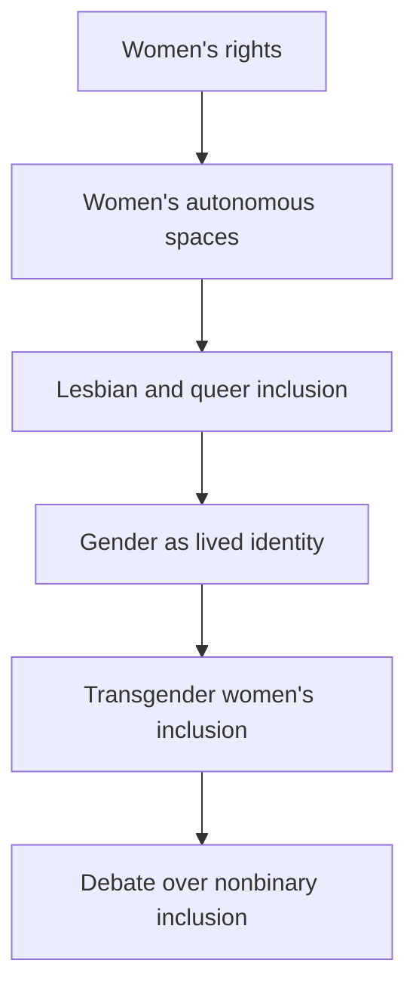

Mills’s significance lies partly in its willingness to confront these questions publicly. It helped move women’s colleges away from treating the meaning of “woman” as fixed or self-evident.

## Mills’s Changing Feminist Position

| Period                  | Predominant emphasis                                 |
| ----------------------- | ---------------------------------------------------- |
| Nineteenth century      | Women’s intellectual and moral equality              |
| Early twentieth century | Professional and civic leadership                    |
| 1960s–1970s             | Economic, reproductive, and personal autonomy        |
| 1970s–1980s             | Lesbian identity and feminist sexual debates         |
| 1980s–1990s             | Race, class, representation, and institutional power |
| 1990                    | Defense of women-centered education                  |
| 1990s–2000s             | Queer studies and intersectional feminism            |
| 2014 onward             | Transgender inclusion and gender diversity           |

## Historical Assessment

Mills was not the most publicly visible center of Bay Area sexual rebellion. San Francisco supplied the better-known feminist sex stores, lesbian erotic publications, experimental pornography, strip-club organizing, and sex-worker activism.

Mills played a quieter institutional role. It provided education, feminist scholarship, queer community, leadership training, artistic experimentation, and a setting in which assumptions about sexuality and gender could be challenged.

Its feminism evolved from giving women access to higher education toward reconsidering the meaning of womanhood itself.

> **Mills transformed transgender inclusion at a women’s college from an informal accommodation into an explicit institutional principle, helping American higher education reconsider whether womanhood should be defined by birth assignment, legal classification, lived identity, or some combination of these.**


# Tijuana Growth: Supporting Safe Borders
## “Vuelve otra vez la Trece — ¡y es aún la Primera!”
|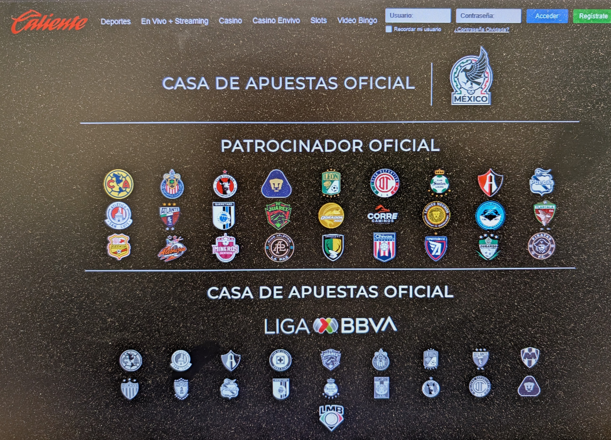 |</br>  </br> [KISS @ Selland Arena](https://ca.rollingstone.com/music/music-features/cynthia-plaster-caster-true-story/) | [https://www.unitree.com/cn](https://www.unitree.com/cn)</br>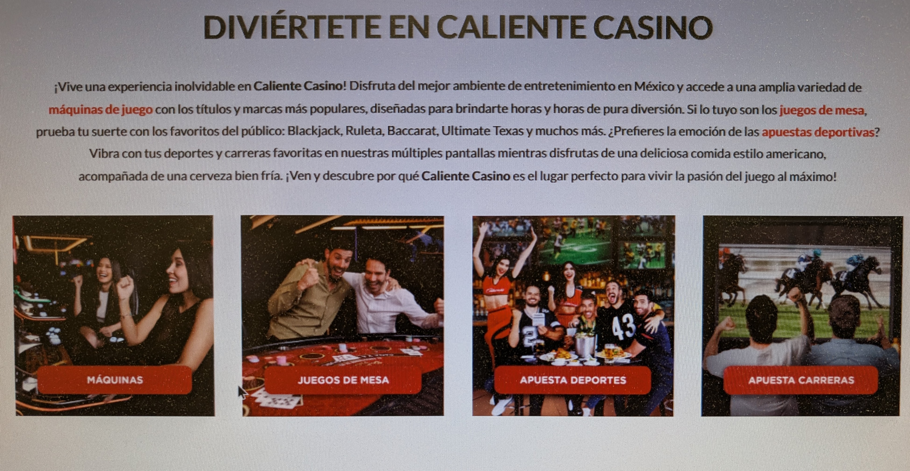</br>**REACH**</br>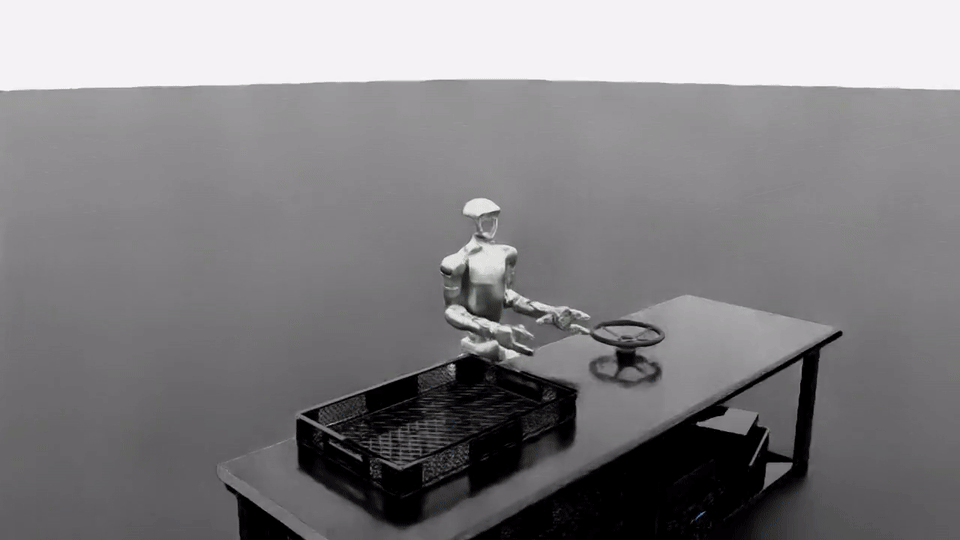</br>[https://www.unitree.com/news/42](https://www.unitree.com/news/42) | 
|--|--|--|


## The Mask as Identity: Two Film Examples

Popular culture provides two almost opposite ways of thinking about **the mask as identity**.

| *Mask* (1985) | *The Mask* (1994) |
|:---:|:---:|
| <a href="https://youtu.be/hEt-7A3EugY"></a> | <a href="https://youtu.be/LZl69yk5lEY"></a> |
| [▶️ Watch on YouTube](https://youtu.be/hEt-7A3EugY) | [▶️ Watch on YouTube](https://youtu.be/LZl69yk5lEY) |
| Society judges Rocky Dennis through his unusual appearance. **Breaking the mask means seeing the authentic person beyond an identity imposed by others.** | A restrained bank clerk puts on a magical mask that releases an uninhibited alter ego. **Putting on the physical mask paradoxically breaks his social mask.** |

### Connecting the Films to Octavio Paz

These films provide accessible parallels to the idea of ***la ruptura de la máscara***—**"the breaking of the mask"**—in discussions of Octavio Paz's *Piedra de Sol* (*Sunstone*).

In *Mask*, **human connection and love help others see beyond an imposed identity**. In *The Mask*, **desire and uninhibited behavior disrupt a socially controlled identity**.

Paz pushes the idea further: **love and erotic encounter can become disruptive forces capable of breaking through social conventions and the identities they impose.**

The progression becomes:

**Mask → Desire / Encounter → Disruption → Recognition → Love → Transformation**

> **The mask is the identity through which society recognizes us. Breaking the mask creates the possibility of recognizing one another—and ourselves—differently.**

# The Thirteenth Returns: Love, Cyclical Time, and the Breaking of the Mask in Octavio Paz's *Sunstone*

## An English-Language Introduction to a Conversation Connecting Octavio Paz, Gérard de Nerval, Fresno State, and UCLA

One intriguing thread in modern Latin American literature begins with an unusual phrase:

> **“Vuelve otra vez la Trece — ¡y es aún la Primera!”**

A natural English rendering is:

> **“The Thirteenth returns again—and it is still the First!”**

The phrase comes from Octavio Paz's Spanish translation of the French poet **Gérard de Nerval's “Arthémis.”** Nerval's original poem provides the epigraph to Paz's great 1957 poem ***Piedra de Sol***, generally translated into English as ***Sunstone***.

The idea is paradoxical but central:

**The thirteenth returns and becomes the first.**

An ending becomes another beginning.

That simple idea opens into a much larger literary exploration of **cyclical time, memory, erotic love, social identity, historical consciousness, and the possibility of human transformation**.

It has also generated an interesting scholarly trail extending from Paz and the broader Latin American literary community to **Fresno State and UCLA**.

---

# Octavio Paz and *Piedra de Sol* (*Sunstone*)

**Octavio Paz (1914–1998)** was a Mexican poet, essayist, diplomat, and one of the most influential Latin American intellectuals of the twentieth century. He received the **1990 Nobel Prize in Literature**.

His *Piedra de Sol* (*Sunstone*) was published in 1957.

The poem is constructed around **cycles**.

It contains **584 hendecasyllabic lines**, corresponding to the approximately 584-day synodic cycle of Venus recognized in the Mesoamerican calendrical tradition. In Paz's original note to the poem, the completion of that Venus cycle represented both **the end of one cycle and the beginning of another**.

The poem reinforces this structurally.

Its opening six lines return at the end.

Therefore:

**The poem ends where it began.**

But the reader who returns to the beginning is no longer quite the same reader, because the entire experience of the poem now stands between the first encounter with those lines and their return.

The cycle can therefore be represented as:

**Beginning**

↓

**Experience**

↓

**Memory**

↓

**Return**

↓

**Beginning Again**

This is not necessarily repetition in the sense of simply doing the same thing again.

It can be **renewal**.

---

# Gérard de Nerval and “The Thirteenth Returns”

Paz deliberately placed lines from French Romantic poet **Gérard de Nerval's “Arthémis”** at the beginning of *Piedra de Sol*.

Paz later translated the poem into Spanish, rendering Nerval's enigmatic opening as:

> **“Vuelve otra vez la Trece — ¡y es aún la Primera!”**

The expression suggests a clock moving beyond twelve.

After twelve comes thirteen—but thirteen can also be understood as **one again**.

Thus:

**12 → 13**

can simultaneously become:

**12 → 1**

The end of one cycle becomes the beginning of another.

Modern scholarship has repeatedly recognized the Nerval epigraph as an important clue to the circular structure of *Piedra de Sol*. Paz combines this European literary reference with Mesoamerican calendrical symbolism and the Venus cycle.

That combination itself is significant.

Paz is bringing together:

**European Romanticism**

*

**Mesoamerican cosmology**

*

**modern Mexican literature**

*

**astronomical cycles**

into a single poetic structure.

---

# UCLA and the Nerval–Paz Connection

The relationship continues to attract contemporary scholarly attention.

A recent **UCLA dissertation** independently examines Paz's relationship with Nerval's *Arthémis*, including Paz's translations of the poem.

The UCLA researcher observes that Paz's translation places particular emphasis on the idea that **the thirteenth hour is also the first**.

The dissertation then makes an especially interesting comparison: Nerval suggests cyclical return, but Paz carries the principle much further in *Piedra de Sol* by making the poem itself return structurally to its beginning.

In other words:

**Nerval provides the idea of return.**

**Paz turns return into poetic architecture.**

This demonstrates that the Nerval connection is not an incidental curiosity. It belongs to an established scholarly discussion surrounding *Piedra de Sol*.

---

# Fresno State: María Jiménez and “The Thirteenth Returns”

The same phrase became the title of graduate research at **California State University, Fresno (Fresno State)**.

Graduate student **María Jiménez** wrote a thesis titled:

> ***Vuelve otra vez la trece: El amor y la ruptura de la máscara en Piedra de sol***

A useful English translation is:

> ***The Thirteenth Returns Again: Love and the Breaking of the Mask in Sunstone***

The Fresno State thesis record confirms that Jiménez studied Octavio Paz and that her thesis chair was **Dr. Saúl Jiménez-Sandoval**, who later became president of Fresno State.

The title is revealing because it combines three concepts:

**cyclical return**

*

**love**

*

**breaking the mask**

These ideas provide an especially useful entry point into *Piedra de Sol* for an English-speaking reader.

---

# What Is “The Mask”?

The Spanish phrase:

> **“la ruptura de la máscara”**

literally means:

> **“the rupture/breaking of the mask.”**

But the “mask” need not mean a physical disguise.

Within the broader intellectual world surrounding Paz, the mask can represent the **social identities people wear**:

* status,
* titles,
* class,
* respectability,
* institutional roles,
* expected behavior,
* political identities,
* gender expectations,
* and the identity a person presents to society.

The mask is therefore the socially recognizable **version of the self**.

The deeper question becomes:

> **What happens when an authentic encounter with another human being breaks through that constructed identity?**

This is where **love** becomes much more than romantic sentiment.

---

# Saúl Jiménez-Sandoval: Love, Memory, and Being

Jiménez-Sandoval later developed his own substantial interpretation of *Piedra de Sol* in:

> **“Love, Memory and Being in Octavio Paz's Piedra de Sol”**

published in 2014 in *The Willow and the Spiral: Essays on Octavio Paz and the Poetic Imagination*.

Jiménez-Sandoval interprets Paz partly through philosopher **Henri Bergson**, particularly Bergson's ideas about memory, consciousness, perception, and voluntary action.

For Jiménez-Sandoval, the past does not simply disappear.

Instead:

**Past ↔ Present**

Memory brings the past into present consciousness.

That consciousness allows the individual to interpret the present differently.

And that creates the possibility of choosing a different future.

The process can be represented as:

**Past**

↓

**Memory**

↓

**Consciousness**

↓

**Recognition**

↓

**Choice**

↓

**Action**

↓

**Becoming**

Jiménez-Sandoval therefore interprets *Piedra de Sol* not merely as a poem about remembering but as a poem about **what remembering makes possible**.

---

# Love as a Source of Transformative Power

This is where love becomes particularly important.

Jiménez-Sandoval does not treat erotic love merely as pleasure.

Indeed, in his reading of the poem, purely sexual fulfillment proves insufficient.

Something more profound must happen.

The encounter with another person can move from:

**sexual attraction**

↓

**erotic encounter**

↓

**recognition of another human being**

↓

**breaking the isolation of the self**

↓

**communion**

↓

**social consciousness**

The isolated **“I”** begins becoming part of a **“we.”**

Love therefore becomes a force capable of disrupting established identity.

---

# Erotic Love as a Disruptive Force

This makes the eroticism of *Piedra de Sol* particularly important.

Sexual desire is potentially **disruptive** because it does not necessarily respect the neat categories through which society organizes human beings.

Society says:

**This is your position.**

**This is your proper role.**

**These are the people you should desire.**

**This is respectable.**

**This is forbidden.**

**This is who you are supposed to be.**

Erotic desire can respond:

**No.**

Desire therefore possesses a potentially subversive quality.

Jiménez-Sandoval cites scholarship describing the revolutionary potential of love and eroticism precisely because they can challenge a **repressive and hierarchical environment**.

This does not mean that every sexual impulse is inherently liberating.

Jiménez-Sandoval's interpretation is more demanding.

Sexuality becomes transformative when erotic encounter develops into **recognition of the other as another human being**.

Thus:

**Sexual Desire → Disruption**

but potentially:

**Love → Recognition → Transformation**

---

# Love Breaks the Mask

This makes María Jiménez's thesis title particularly suggestive.

If the **mask** represents socially imposed identity, love potentially allows two people to encounter one another beneath those categories.

The sequence becomes:

**Social Identity**

↓

**Mask**

↓

**Erotic Encounter**

↓

**Recognition**

↓

**Breaking the Mask**

↓

**Authentic Relationship**

↓

**Transformation**

Jiménez-Sandoval's published analysis of Paz strongly overlaps with this idea.

He describes historical and personal consciousness as capable of shattering society's **“masks, titles, laws and pretensions”**—structures that establish hierarchies and separate people both from others and from themselves.

Love therefore becomes more than emotion.

It becomes a form of **social and existential power**.

---

# The Cycle Does Not Have to Mean Imprisonment

This brings us back to the thirteenth returning as the first.

Cyclical time can have two very different meanings.

One possibility is:

**Repetition without consciousness**

↓

**same pattern**

↓

**same outcome**

↓

**repeat again**

But Paz allows another possibility:

**Return**

↓

**Memory**

↓

**Recognition**

↓

**Transformation**

↓

**New Beginning**

The person returns to the beginning carrying the experience of the previous cycle.

The starting point may look familiar.

But the consciousness arriving there has changed.

That is the difference between **repetition** and **renewal**.

---

# A Broader Latin American Literary Conversation

These questions extend well beyond *Piedra de Sol*.

Twentieth-century Latin American literature repeatedly explores tensions among:

* indigenous and European cultural inheritance,
* colonialism and independence,
* tradition and modernity,
* myth and scientific rationalism,
* capitalism and human value,
* individual identity and collective history,
* memory and forgetting,
* political power and personal freedom,
* sexuality and social convention,
* linear progress and cyclical history.

Paz's achievement in *Piedra de Sol* is partly to place many of these tensions inside the experience of a single consciousness.

The individual remembers.

The individual desires.

The individual loves.

The individual encounters history.

And personal experience gradually opens toward a much larger question:

> **How can human beings become something different from what history and society have already told them they must be?**

---

# From Nerval to Paz to Fresno State to UCLA

The intellectual trail can therefore be summarized:

### Gérard de Nerval — *Arthémis*

**The Thirteenth returns and becomes the First.**

Time can return.

↓

### Octavio Paz — *Piedra de Sol* / *Sunstone*

Paz combines Nerval's return with Mesoamerican cyclical time, the Venus cycle, memory, history, sexuality, and love.

The poem itself circles back to its beginning.

↓

### María Jiménez — Fresno State

***The Thirteenth Returns Again: Love and the Breaking of the Mask in Sunstone***

The title brings together:

**cyclical return + love + disruption of social identity**

Her thesis was chaired by **Saúl Jiménez-Sandoval**.

↓

### Saúl Jiménez-Sandoval — Fresno State

***Love, Memory and Being in Octavio Paz's Piedra de Sol***

Jiménez-Sandoval develops a philosophical interpretation connecting:

**memory + love + history + consciousness + justice + voluntary action + becoming**

↓

### Contemporary UCLA Scholarship

The Nerval–Paz relationship continues to receive scholarly attention, including close examination of Paz's translation of *Arthémis* and the significance of the **thirteenth returning as the first**.

The conversation therefore extends across generations and institutions.

---

# A Powerful Way to Read *Piedra de Sol*

For an English-speaking reader encountering Paz for the first time, one productive framework is:

> **We inherit history, memory, identities, and social masks—but those inheritances do not necessarily determine what we must become.**

The cycle returns.

The past becomes present.

But something can interrupt automatic repetition.

For Paz, that disruptive power can emerge through **love**.

Erotic attraction breaks ordinary boundaries.

Authentic recognition breaks the mask.

Memory brings forgotten experience into consciousness.

Consciousness makes choice possible.

And choice opens the possibility of becoming.

The cycle therefore becomes:

**History**

↓

**Inherited Identity**

↓

**Desire**

↓

**Love**

↓

**Breaking the Mask**

↓

**Recognition**

↓

**Memory**

↓

**Conscious Choice**

↓

**Transformation**

↓

**Return**

↓

**A New Beginning**

Perhaps that is the deeper meaning contained in the strange phrase with which this discussion began:

> **The Thirteenth returns—and becomes the First.**

We return to places history has taken us before.

The transformative possibility lies in **not necessarily returning as the same person**.

---

## References and Further Context

* **Octavio Paz**, *Piedra de Sol* (*Sunstone*), first published in 1957.
* **Gérard de Nerval**, *Arthémis*, from *Les Chimères* (1854). Paz used its opening as the epigraph to *Piedra de Sol* and later translated the poem into Spanish. The Nerval connection and Paz's translations are documented in scholarship on *Piedra de Sol*.
* Paz's original structural conception connected the poem's **584 hendecasyllabic lines** with the 584-day Venus cycle and described its completion as the end of one cycle and beginning of another.
* **María Jiménez**, *Vuelve otra vez la trece: El amor y la ruptura de la máscara en Piedra de sol*, Fresno State graduate thesis. Fresno State's thesis listing identifies **Saúl Jiménez-Sandoval as chair**.
* **Saúl Jiménez-Sandoval**, “Love, Memory and Being in Octavio Paz's *Piedra de Sol*,” in *The Willow and the Spiral: Essays on Octavio Paz and the Poetic Imagination*, edited by Roberto Cantú, Cambridge Scholars Publishing, 2014.
* Contemporary **UCLA dissertation research** analyzes Paz's translations of Nerval's *Arthémis* and specifically examines his emphasis on the thirteenth returning as the first.


[Serendipity](https://youtu.be/FXUiEPrK_II?si=nnpePcH0BEqRqDNK)
## Video Summary: “Serendipity, Discovery and Joy in Chemistry”

[Watch the video on YouTube](https://www.youtube.com/watch?v=FXUiEPrK_II)

In this 2017 Fresno State Talk, chemistry professor Dr. Joy Goto combines autobiography, chemistry instruction, and scientific research to explain how curiosity, mentors, students, and unexpected discoveries shaped her career. The lecture was part of a series honoring professors selected for their ability to engage and inspire students. [Fresno State News](https://www.fresnostatenews.com/2017/02/03/fresno-state-talks-lecture-series-covers-chemistry-camaraderie-and-bob-dylan/)

Goto describes her development as if it were a chemical reaction: childhood experiences, teachers, family members, mentors, and research opportunities acted as “catalysts,” transforming “little Joy” into a scientist, professor, and mentor. Her early fascination with colorful chemical reactions—especially fireworks and chemistry kits—developed into a broader interest in understanding how matter changes and how chemistry can benefit society.

A central theme is that science becomes meaningful when students move beyond textbook knowledge and participate in research. Goto presents research as a careful investigation of the unknown that allows students to make genuine discoveries and potentially improve people’s lives.

### Fresno, Family, and Hiroshima

Goto was born and raised in Fresno and describes herself as a third-generation Japanese American with ancestral roots in Hiroshima. Although the video concentrates primarily on her scientific development, later interviews reveal an important personal connection between her family and one of the defining events of the twentieth century.

Goto’s mother was born near Hiroshima and was approximately eleven years old when the United States dropped the atomic bomb on the city on August 6, 1945. According to Goto, her mother lived several miles from the hypocenter and remembered seeing the mushroom cloud.

> “For me, [the event] is pretty personal. My mother was born in Hiroshima, not directly in the city but about 5 miles from the epicenter. When she was a child, she saw the mushroom cloud.”

—Dr. Joy Goto, quoted by [Fresno State Today](https://today.fresnostate.edu/fresno-state-to-commemorate-80th-anniversary-of-wwii-atomic-bombings/)

A second account similarly reports that her mother was eleven years old and living approximately ten to twelve miles from the hypocenter. In that interview, Goto also connected her family story to the larger history of Japanese settlement in the Central Valley, noting that Fresno County attracted many immigrants from the Hiroshima region, particularly through agriculture. [The kNOw Youth Media](https://theknowfresno.org/08/18/2025/fresno-community-commemorates-hiroshima-and-nagasaki-atomic-bombings/)

The available sources do not provide the complete story of when or how her mother came to the United States. Nevertheless, this family connection helps explain Goto’s continuing involvement in Fresno’s Japanese American community, the Japanese American Citizens League, human-rights activities, and local commemorations of the Hiroshima and Nagasaki bombings.

Her mother’s experience also adds another dimension to the lecture’s emphasis on science serving humanity. Chemistry can produce beautiful and beneficial transformations, but the history of Hiroshima demonstrates that scientific knowledge can also be used destructively. Although Goto does not develop this contrast explicitly in the video, her family history gives special significance to her emphasis on responsible scientific communication, mentorship, community service, and research intended to reduce human suffering.

### Her Scientific Journey

Goto organizes her research career around three proteins, molecules, or disease problems:

- Copper-zinc superoxide dismutase (SOD) and amyotrophic lateral sclerosis (ALS)
- Amyloid precursor protein and Alzheimer’s disease
- The environmental neurotoxin BMAA and the neurodegenerative condition ALS-PDC

She explains that oxygen metabolism can produce reactive molecules called free radicals. The SOD enzyme normally helps neutralize these damaging molecules, but changes in the enzyme have been associated with inherited forms of ALS.

Her postdoctoral research shifted toward Alzheimer’s disease and the abnormal processing and folding of proteins. Small protein fragments can accumulate into plaques and tangles, interfering with normal neurological function. She uses a language metaphor to make this understandable:

- Nucleotides and amino acids are the alphabet.
- Codons and small protein structures are words.
- Genes and complete proteins are sentences.

A misplaced or abnormal “letter” can therefore alter the resulting word, sentence, and biological function.

### BMAA and Fruit-Fly Research

The final scientific section focuses on BMAA, a molecule produced by cyanobacteria and investigated for a possible connection to ALS-PDC, a disease historically found at unusually high rates in Guam. BMAA may accumulate through the food chain and chemically resemble substances normally used by the nervous system, including glutamate.

Goto’s Fresno State research group used fruit flies as a model organism because they reproduce quickly, have well-understood genetics, and possess neurons that share important characteristics with human neurons. Students fed fruit flies BMAA and observed:

- Tremors and abnormal movement
- Reduced climbing ability
- Changes in electrical signaling between neurons
- Decreased survival or neurological function

The researchers also investigated whether the amino acid L-serine could reduce some of BMAA’s effects. Their fruit-fly results contributed to broader collaborative research using vertebrate models and, at the time of the lecture, early human investigations. These findings are presented as promising research directions, not as proof of an established treatment.

### Teaching and Mentorship

The lecture repeatedly returns to Goto’s identity as a teacher. She uses models, demonstrations, audience questions, and familiar analogies to make molecular science tangible. She also emphasizes that much of the laboratory work was performed by Fresno State undergraduate and graduate students.

For Goto, mentoring students is not separate from scientific discovery. Student research connects classroom concepts with unanswered questions and allows students to see themselves as contributors to science.

Her commitment to mentorship also reflects the educational values of her own family. Goto has credited her parents, teachers, and two older brothers with teaching her to strive and instilling a strong respect for education. She presents scientific development not as the work of an isolated individual but as a process shaped by family, teachers, collaborators, and students.

### Conclusion

Goto ends with a luminol demonstration that produces visible blue light. The experiment brings her story full circle: she was originally attracted to chemistry by the beauty of visible reactions, and she continues to use that sense of wonder to motivate students and guide research.

The video’s larger message is that science is both intellectual and deeply human. Discovery grows from curiosity, careful observation, collaboration, mentorship, and a willingness to follow unexpected results. The “joy” in chemistry is therefore both Dr. Goto herself and the excitement of making the invisible workings of nature understandable.

Her family’s connection to Hiroshima adds a deeper historical dimension to that message. Science cannot be separated entirely from the people, communities, and historical events it affects. Goto’s career—combining scientific research, education, mentorship, community engagement, and efforts to understand human disease—illustrates one way scientific knowledge can be directed toward discovery, healing, and service.

<h2 align="center">Featured Video</h2>

<p align="center">
  <a href="https://youtu.be/FXUiEPrK_II">
    
  </a>
</p>

<p align="center">
  <a href="https://youtu.be/FXUiEPrK_II">▶️ Watch on YouTube</a>
</p>

| | |
|--|--|
| | 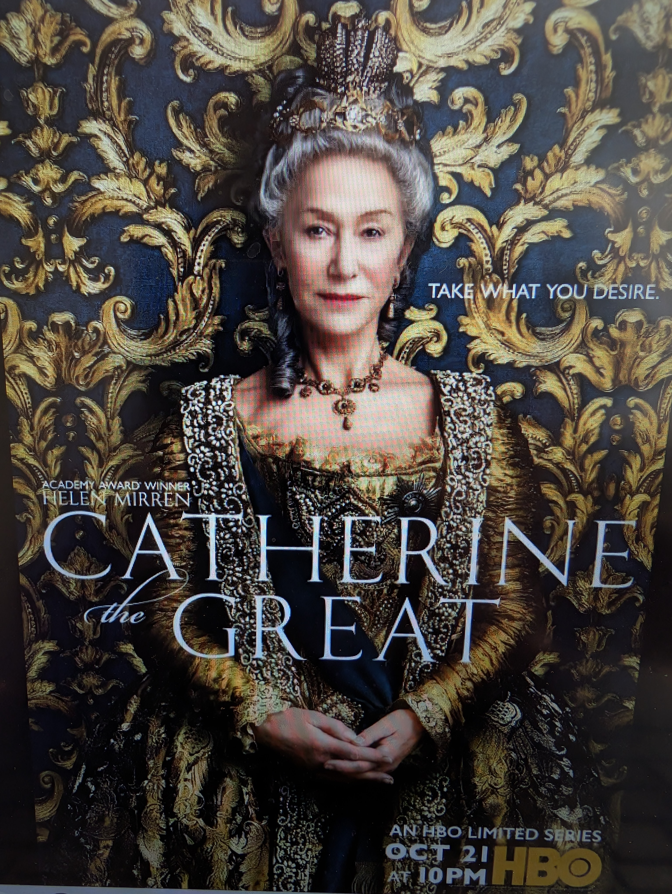|

# The Cultural Cenote

Modern American culture is often described as something built from European traditions and then modified over time by Indigenous, African, and later immigrant influences.

But perhaps that model is too shallow.

A more revealing metaphor comes from the Maya world of the Yucatán.

## The Hidden Infrastructure

Much of the Yucatán has little visible surface water. Beneath the limestone, however, lies a vast groundwater system.

Cenotes are the openings where that hidden system becomes visible and accessible.

For Maya communities, cenotes were not merely practical water sources. They became important cultural and sacred places, often closely connected with settlement, ritual, and major centers of civilization.

The visible culture above ground rested upon something much deeper.

> **The cenote was a visible opening into a hidden infrastructure.**

That offers an interesting metaphor for understanding American culture.

---

## Indigenous Culture as the Hidden Aquifer

Long before Europeans arrived, Indigenous peoples had spent thousands of years developing relationships with the landscapes of the Americas.

They accumulated knowledge of:

* agriculture
* water
* plants and animals
* geography
* transportation routes
* climate
* technologies
* trade
* diplomacy
* warfare
* settlement
* and survival

This was not simply a collection of isolated customs.

It was a kind of **cultural infrastructure built through long experience with the land**.

When Europeans arrived, they did not enter an empty continent.

They entered a world already shaped by generations of human knowledge.

---

## Cultural Cenotes

Some parts of that deeper Indigenous foundation remain visible.

Corn is one.

Place names are another.

Agricultural practices, regional foods, landscape knowledge, frontier traditions, and elements of American mythology provide others.

These can be thought of as **cultural cenotes**:

> **visible openings into a much deeper historical substrate.**

Corn becomes American food.

Cornbread becomes American cooking.

Corn whiskey becomes an American spirit.

Bourbon becomes internationally identified with America.

The corn cob pipe becomes rural Americana.

Indigenous place names become ordinary American geography.

Hybrid frontier traditions become simply **American**.

The deeper origins often disappear from view even while the cultural structure continues to depend upon them.

---

## Not Absorbed, but Hardened

The metaphor becomes more powerful when we consider what happened under European expansion.

Indigenous cultures were not simply absorbed into European culture.

They experienced enormous pressure:

**conquest, displacement, alliance, resistance, disease, coercion, trade, adaptation, and cultural exchange.**

Some traditions were destroyed.

Others survived.

Still others changed form.

What persisted was often reshaped and hardened through centuries of external pressure.

This suggests a different way to understand the cultural development of the Americas:

> **European imperialism transformed Indigenous America, but Indigenous America also transformed the Europeans who entered it.**

The result was not Europe recreated overseas.

It was something new.

---

## The Alloy Above, the Aquifer Below

Two metaphors work together here.

The **alloy** describes cultural synthesis.

Indigenous, European, African, and later global elements were fused together under the pressures of conflict, accommodation, migration, and survival.

The **aquifer** describes cultural persistence.

Beneath the visible culture lies an older foundation formed through thousands of years of Indigenous interaction with the land.

So perhaps:

> **American culture is an alloy forged under pressure, resting upon an Indigenous cultural aquifer accumulated through thousands of years with the land.**

The cultural forms visible today are the surface.

The deeper infrastructure can be harder to see.

---

## The Cultural Cenote

A cenote reveals only a small opening.

What lies beneath is much larger.

Perhaps many familiar pieces of American culture work the same way.

A food.

A place name.

A farming practice.

A frontier tradition.

A cowboy.

A bottle of bourbon.

Each may offer a glimpse into a deeper cultural history that is usually hidden beneath the label **American**.

And that leads to a broader possibility:

> **The uniqueness of American culture may come not simply from European traditions transplanted to a new continent, but from the long cultural synthesis produced when newcomers entered an Indigenous world already deeply shaped by the land.**

The temples may change.

The cultures above ground may be transformed.

But beneath them remain older structures of knowledge, adaptation, and memory.

That is the idea of the **Cultural Cenote**:

> **A visible opening into the hidden Indigenous infrastructure beneath American culture.**


# American Culture: An Alloy of Indigenous-European Synthesis

American culture is often described as a European culture transplanted to the New World and gradually transformed into something distinct.

But that framing may have the direction partly backward.

A more revealing way to think about American culture is as a **cultural alloy formed on Indigenous foundations**.

> **American culture can be seen as a cultural alloy: Indigenous foundations combined with European, African, and later global elements, repeatedly reshaped under the enormous pressures of alliance, conquest, resistance, accommodation, migration, and survival.**

The key word is **foundations**.

Europeans did not arrive in an empty landscape. They entered societies with established agriculture, trade networks, political alliances, technologies, food systems, transportation routes, military traditions, and deep knowledge of the land.

To survive and prosper in the Americas, newcomers had to adapt.

That adaptation helped create something that was no longer simply European.

---

## Indigenous Foundations

Some influences remain easy to recognize.

Native peoples developed or cultivated crops that later became central to life throughout the Americas:

* corn
* beans
* squash
* potatoes
* tomatoes
* peppers
* cacao
* tobacco

But what happens after those crops enter mainstream culture is even more interesting.

Corn becomes ordinary American food.

Cornbread becomes American cooking.

Corn whiskey becomes an American spirit.

Bourbon becomes internationally associated with the United States.

Even the **corn cob pipe** becomes an image of rural Americana.

The Indigenous origin remains underneath all of these traditions, but eventually the resulting products are simply called **American**.

---

## From Exchange to Identity

The same process extends well beyond food.

Native geographic knowledge became part of frontier knowledge.

Native trails became roads and transportation corridors.

Native place names became the names of states, cities, rivers, and regions.

Colonists adapted to Native methods of travel, hunting, agriculture, diplomacy, and warfare.

And across the West, Spanish ranching, Mexican vaquero traditions, Indigenous knowledge and horsemanship, African-American labor, and Anglo-American settlement combined into what later became one of the strongest symbols of American identity:

**the cowboy.**

The cowboy is not a purely European creation.

It is a cultural alloy.

---

## Alliance, Conflict, and Survival

This blending was not always peaceful.

Native nations were independent political powers. European empires—and later the United States—had to negotiate, trade, form alliances, and sometimes fight with them.

During the American Revolution, Native nations made their own strategic decisions. Some allied with the Patriots, while many others supported Britain because they feared that an independent United States would expand further into Native lands.

That history produces a difficult but important contradiction:

> **Native peoples helped shape the society that became the United States even as that expanding society increasingly threatened Native sovereignty.**

American culture therefore emerged not simply through borrowing, but through a much harsher process of **alliance, conflict, resistance, adaptation, dispossession, compromise, and survival**.

That is why the metaphor of an **alloy** works so well.

An alloy is not merely one material with a few decorations added.

Its components are fused together and transformed under pressure into something new.

---

## What Became "American"?

This raises an interesting question.

Perhaps one of the peculiarities of American identity is that successful cultural blending often becomes invisible.

> **The more completely a cultural contribution becomes absorbed, the more likely later generations are to forget where it came from.**

Corn becomes American.

Cowboys become American.

Frontier knowledge becomes American ingenuity.

Indigenous place names simply become the map of America.

Hybrid traditions become national mythology.

The result is a culture that can appear self-created even though its distinctiveness came precisely from centuries of cultural contact.

---

## A Different Way to Think About America

Rather than imagining:

**Europe → America → American Culture**

perhaps the better model is:

**Indigenous Americas**
**+ European settlement and imperialism**
**+ African cultures and forced migration**
**+ alliance, resistance, adaptation, and exchange**
**+ later global migrations**
↓
**American Culture**

This does not mean that modern American culture is simply Indigenous culture under another name.

It means something more interesting:

> **The uniqueness of American culture is not simply European culture transplanted to the New World. It is a product of cultural synthesis in the Americas, with Indigenous cultures playing a foundational role that is often hidden inside traditions later labeled simply "American."**

Perhaps the final question is the most revealing:

> **If we removed from American culture everything whose existence depended upon Indigenous America, how recognizably "American" would what remained actually be?**


# What's in a Name? Loyalists, Patriots, Nationalists, and the Language of Empire

When we think about the American Revolution, it is tempting to describe the conflict simply as **Americans versus the British**.

But that is not quite right.

The thirteen colonies themselves were divided. Many colonists supported independence, while others remained loyal to Great Britain. Still others tried to remain neutral.

The names we use for these groups tell us something important about how history is remembered.

## Patriots, Loyalists, Rebels, and Tories

During the American Revolution, the most common terms were:

* **Patriots** — colonists who supported independence from Great Britain.
* **Loyalists** — colonists who remained loyal to the British Crown.
* **Tories** — another common term for Loyalists.
* **Whigs** — sometimes used for supporters of the revolutionary cause.
* **Neutrals** — colonists who attempted to avoid taking either side.

The word **colonialist** would not be especially useful here because nearly everyone involved on the American side was a colonist. George Washington was a colonist. So were Benjamin Franklin, Thomas Jefferson, and the Loyalists who opposed them.

The real division was closer to:

> **Imperial Loyalists vs. Independence Revolutionaries**

or, in more general historical language:

> **Pro-Imperial Forces vs. Nationalist or Independence Movements**

That distinction becomes useful when comparing the American experience with other parts of the British Empire.

---

## The Same Person Can Be a Patriot or a Rebel

One of the interesting things about political language is that the same person can receive very different names depending upon who is doing the naming.

From the viewpoint of the American revolutionaries:

> George Washington and his supporters were **Patriots**.

From the viewpoint of the British government:

> They were **rebels** engaged in an illegal insurrection against their lawful government.

Likewise, the Loyalists could describe themselves as citizens defending legal order and political stability.

The Patriots could describe those same people as defenders of imperial domination.

This suggests an important lesson:

> **Political names are rarely neutral.**

They often contain an argument about who possesses legitimate authority.

The winning side also tends to influence the terminology that later generations inherit.

---

## A More General Vocabulary of Empire

Across many colonial conflicts, we can identify a rough political spectrum:

**Imperial Government**
← Imperial Loyalists
← Moderates / Reformers
→ Nationalists
→ Independence Revolutionaries
**Independent State**

Not every colonial conflict follows this pattern exactly, but the terminology travels surprisingly well.

Terms such as **loyalist**, **nationalist**, **anti-colonial**, **independence movement**, and **self-government** are usually more useful for comparison than trying to apply the American labels *Patriot* and *Tory* everywhere.

The term **collaborator** should be used more carefully. It usually contains a moral judgment that the government being assisted was illegitimate or occupying foreign territory.

A British Loyalist in Massachusetts in 1775 would not have considered himself a collaborator.

He would probably have considered himself a loyal British citizen.

---

## India: Nationalism and the British Raj

India offers a recognizable comparison, although its history was vastly more complicated than that of the thirteen colonies.

Under British rule, India contained many different political positions:

* British colonial officials
* Indian officials serving the Raj
* rulers of princely states who cooperated with Britain
* constitutional reformers
* Indian nationalists
* members of the Indian National Congress
* supporters of the Muslim League
* revolutionary anti-British organizations
* millions of people whose political views changed or did not fit neatly into any category

A very simplified spectrum might look like:

**British Imperial Rule**
← Pro-Raj / Imperial Loyalists
← Constitutional Reformers
→ Indian Nationalists
→ Independence Movements

India therefore resembles the American experience in one important respect:

> The struggle was not simply foreigners on one side and a unified native population on the other.

Colonized societies themselves could contain major disagreements about independence, reform, political identity, and the benefits or dangers of leaving an empire.

India ultimately became independent in **1947**, but through a very different historical process from the American Revolution.

---

## South Africa: When the Categories Become Complicated

South Africa demonstrates why simple colonial labels can quickly break down.

Different periods contain completely different political struggles.

During the Boer Wars, one major conflict involved:

> **British Imperial Power vs. Boer/Afrikaner Nationalism**

But the Boer republics were themselves settler societies descended primarily from European colonists.

Later, under apartheid, the major political conflict increasingly involved:

> **The Apartheid State vs. African Nationalist and Liberation Movements**

Organizations such as the African National Congress represented a very different form of nationalism from that of the earlier Boer republics.

South African history therefore reminds us that the categories **colonizer**, **colonized**, **settler**, **nationalist**, and **imperialist** can overlap.

They can also change meaning over time.

---

## Australia: Independence Without a Revolution

Australia followed a dramatically different path.

Britain eventually accomplished in Australia something it had failed to accomplish in the thirteen American colonies:

> It allowed substantial self-government without provoking a revolutionary break.

Australia developed gradually through stages:

**British Colonies**
→ **Responsible Self-Government**
→ **Federation in 1901**
→ **Dominion Status**
→ **Increasing Legislative Independence**

The final constitutional connections with Britain were gradually reduced over the twentieth century, with the **Australia Acts of 1986** representing an important final step.

There was therefore no Australian equivalent of the American **Patriot vs. Loyalist** struggle.

An Australian could simultaneously be:

* strongly Australian,
* supportive of Australian self-government,
* culturally attached to Britain,
* and loyal to the British monarch.

This is important because:

> **National identity does not automatically require hostility toward an empire.**

Political independence can sometimes emerge gradually rather than through revolution.

---

## Singapore: Decolonization Through Transition

Singapore followed another path.

Its history can be simplified as:

**British Colony**
→ **Internal Self-Government**
→ **Federation with Malaysia**
→ **Independent Singapore**

Singapore achieved internal self-government in **1959**, joined Malaysia in **1963**, and became a fully independent state in **1965**.

The most useful vocabulary here is therefore not *Patriots versus Loyalists*, but terms such as:

* colonial administration
* anti-colonial movement
* self-government
* nationalism
* decolonization
* independence

Singapore belongs to the great twentieth-century wave of decolonization, when European empires were increasingly willing—or forced by circumstances—to negotiate transfers of political authority.

---

## Hong Kong: Independence Was Not the Main Question

Hong Kong presents a significantly different problem.

British rule ended in **1997**, but Hong Kong did not become an independent country.

Instead:

**British Colonial Administration**
→ **Transfer of Sovereignty to China**
→ **Hong Kong Special Administrative Region**

The central political question was therefore not simply:

> Should Hong Kong become independent from Britain?

It was also:

> Who should possess sovereignty over Hong Kong after British rule?

And later:

> How much political autonomy should Hong Kong retain within China?

This produces a different vocabulary:

* pro-Beijing
* pro-democracy
* localist
* pro-establishment
* historically pro-British
* autonomy
* sovereignty

The American Patriot/Loyalist model does not map neatly onto Hong Kong.

---

## Macau: Another Transfer of Sovereignty

Macau followed a similar pattern.

For centuries associated with Portuguese rule, Macau was transferred to Chinese sovereignty in **1999**.

The broad progression was:

**Portuguese Administration**
→ **Transfer to China**
→ **Macau Special Administrative Region**

Like Hong Kong, Macau did not become an independent national state following European colonial rule.

It therefore belongs to a somewhat different category:

> **Decolonization through transfer of sovereignty rather than national independence.**

---

## Three Questions Hidden Inside the Word "Independence"

These examples suggest that discussions of colonialism often combine three different questions.

### 1. Who possesses sovereignty?

At one end:

> **Imperial government**

At the other:

> **Independent national government**

### 2. How much local self-government exists?

A territory might remain within an empire while possessing substantial political autonomy.

The range might look like:

> **Direct colonial administration → local autonomy → responsible self-government**

### 3. What political identity do people hold?

People can simultaneously identify with more than one political community.

For example:

> British and Australian

or historically:

> British and American

These identities only become mutually exclusive when political events force people to choose.

---

## Different Roads Out of Empire

The history of the British and European empires produced several different pathways.

### United States

**British Colony → Revolution → Independent Republic**

### India

**British Rule → Nationalist Movement → Decolonization → Independent State**

### Australia

**British Colonies → Self-Government → Federation → Gradual Constitutional Independence**

### Singapore

**British Colony → Self-Government → Malaysia → Independent Republic**

### Hong Kong

**British Colony → Transfer of Sovereignty to China → Special Administrative Region**

### Macau

**Portuguese Administration → Transfer of Sovereignty to China → Special Administrative Region**

### South Africa

**Multiple Settler, Imperial, Nationalist, Racial, and Decolonization Conflicts Across Different Historical Periods**

There was no single path out of empire.

---

## What's in a Name?

Quite a lot.

Consider these pairs:

**Patriot / Rebel**

**Loyalist / Collaborator**

**Nationalist / Separatist**

**Liberator / Insurgent**

**Imperial Government / Legitimate Government**

Each pair can describe similar political behavior while making a very different judgment about its legitimacy.

That is why one of the most useful ways to compare colonial conflicts is to begin with relatively neutral questions:

> **Who claims sovereignty?**

> **Who supports the existing imperial government?**

> **Who seeks greater local autonomy?**

> **Who seeks complete independence?**

> **What political identities are competing?**

Once those questions are separated, the differences between the American Revolution, India, South Africa, Australia, Singapore, Hong Kong, and Macau become much clearer.

And perhaps the most interesting lesson is that **the names themselves are part of the conflict**.

A "Patriot" to one side may be a "Rebel" to the other.

A "Loyalist" may be defending legitimate government—or defending an empire.

History determines not only who wins.

It often determines **what everyone gets called afterward**.


