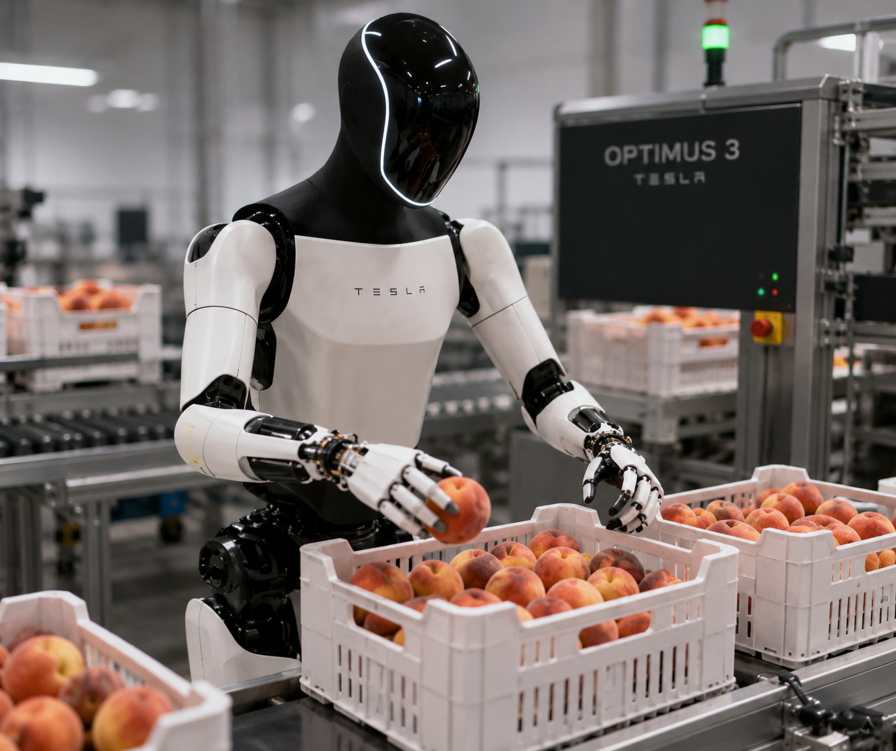

# Robotic Automation for Fruit Packing Industry
Looking for Seasonal Work.  
| | |
|---|---|
| |  |

Will Work tirelessly and consistently for hours without breaks. 
Desired salary: $1.00 an hour.

# Boozy Bonfire Parties or Figure it out, I'm Busy!
## A quote from Nobody's Girl: A Memoir of Surviving Abuse and Fighting for Justice (2025)
## by Virginia Roberts Giuffre

> When I was eleven, I got my period. For years, as adults had forced me to do things no child should know about, I’d been praised sometimes for acting “grown up.” But no one had bothered to tell me what happened when a girl actually grew up. I had no idea what was coming. I remember being outside at one of my parents’ boozy bonfire parties, running around with some other kids, when I looked down at my jeans and saw a creeping red stain. Was I bleeding to death? I wondered. Pale and terrified, I sought out Mom, who glared at me as she appraised my bloody pants. Then, without putting down her beer, she headed into the house, scrounged around in the cupboard under the bathroom sink, and handed me a sanitary pad. “Figure it out,” she said, turning on her heel and leaving me alone. Locking the door behind her, I sat down on the toilet and cried.
