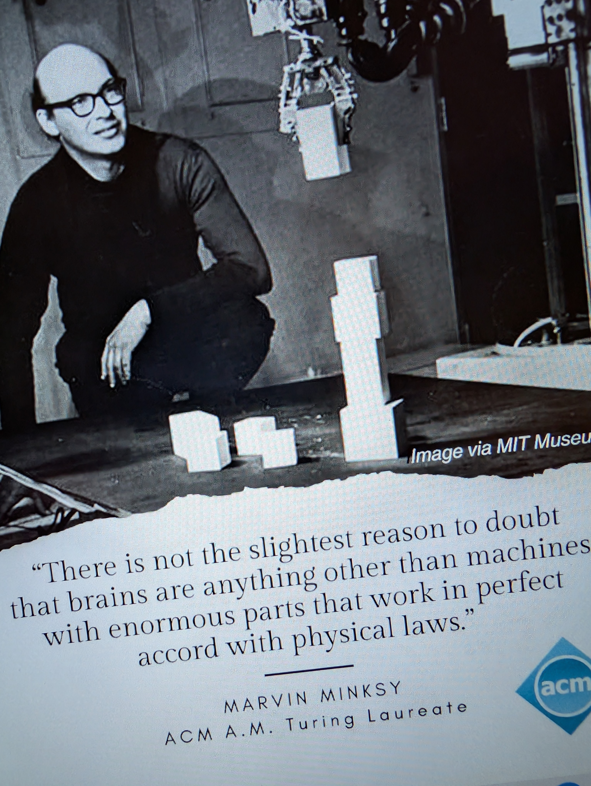

# The Photo (Gamma not Beta)

| | | |
|--|--|--|
| </br> </br> Excerpt from "A Voice Like Mine" by Deb Halland, ```My grandmother told me that her father was the first in her family to be sent to an Indian Boarding School. The schools were part of the US government’s policy of forcing Indigenous children to leave their families and cultures to “kill the Indian in him, but save the man,” as army officer Richard Henry Pratt, who founded the Carlisle Indian School, put it in 1892. Grandma said that her dad was put on a train as a child and sent east to Carlisle, the first Native American boarding school in the United States. When my great-grandfather came home, the school administrators had given him a new name: Gaylord Steele.```  | (1) [curiousity1, goal1, risk1] Clear/Recognized</br>*How Handle??*</br>```[Send/Offer/Provide](Sol)``` via **Car Ride Offer**</br> <a href="g1-fixedbase-step-0.mp4">  </a></br>(2) ```Choose Sol=[Act1, Act2, Act3] ; Exec Sol```</br>(3) ```State=[True(goal1), False(Risk1)]```</br>```(*) Choice([LeanIn, LeanOut])```</br>LeanIn: SocialImpacts, LeanOut: GroupDisconnect</br>Excerpt from "Nobody's Girl" by Virginia Roberts Giuffre, ```'Now, I chose to blame my mother. “How can she say what I’m doing with Kyle is bad, when Dad and Forrest do things to me that are so much worse?” I asked myself.'```</br>Intimacy Control</br>**Boozy Beer Parties**</br>```Then something happened that made sure life had no more good parts. Forrest was a friend of my father’s. He was tall and muscular, with a military bearing, and he had a tattoo on his chest. I knew this because he liked to show off his physique at the pool-and-beer parties our two families began having together. ...```</br>```Suddenly, Forrest—who had his own landscaping business—was around our house a lot. My dad encouraged Skydy and me to call him “Uncle Forrest” and told me to befriend his stepdaughter, Sheila, which I was happy to do. She was sixteen—nine years older than me—so I thought she was the epitome of cool.``` ... </br>**smooth**```His chest was shaved, and he wanted me to admire its smoothness. “Touch my muscles,” he commanded. “Tell me how big they are.”```</br> ```When I was eleven, I got my period. For years, as adults had forced me to do things no child should know about, I’d been praised sometimes for acting “grown up.” But no one had bothered to tell me what happened when a girl actually grew up. I had no idea what was coming. I remember being outside at one of my parents’ boozy bonfire parties, running around with some other kids, when I looked down at my jeans and saw a creeping red stain. Was I bleeding to death? I wondered. Pale and terrified, I sought out Mom, who glared at me as she appraised my bloody pants. Then, without putting down her beer, she headed into the house, scrounged around in the cupboard under the bathroom sink, and handed me a sanitary pad. “Figure it out,” she said, turning on her heel and leaving me alone. Locking the door behind her, I sat down on the toilet and cried.``` |  **Born AGain! So, Saved by the Bells**</br>*You need to ask God for forgiveness*</br> Excerpt from "Nobody's Girl" by Virginia Roberts Giuffre, ```“Uncle Forrest has something he wants to say to you,” Dad said, as a bump of adrenaline hit me. I wanted to run, but my feet wouldn’t move. “He is a man of God now, born again,” Dad continued, “and it’s important that you respect your elders and hear him out.”``` ... ```Forrest stood up and grabbed me by my shoulders, then pushed me to my knees, where he’d forced me to be so many times before. This time, though, he was clothed. “You need to ask God for forgiveness,” he said, sort of bellowing, “for what you did with your dad and me.” I couldn’t believe what I was hearing. As horrible as I felt about myself, some part of me knew that what had happened with Dad and his friend wasn’t all my fault. But standing over me now, Forrest just kept on, half-yelling, half-preaching.```|
|  </br></br> Pick A Sticker.</br>Bully Groups | ```import gymnasium as gym```</br>```import torch```</br>```import isaaclab_tasks```</br>```from isaaclab_tasks.utils import parse_env_cfg```</br>```env_cfg = parse_env_cfg(```</br>```  "Isaac-PickPlace-FixedBaseUpperBodyIK-G1-Abs-v0",```</br>```  device="cuda:0",num_envs=1)```</br>```env = gym.make(```</br>```  "Isaac-PickPlace-FixedBaseUpperBodyIK-G1-Abs-v0",```</br>```  cfg=env_cfg, render_mode="rgb_array")```</br></br> **Trauma Symptoms:** </br> Mal-adaptations | <a href="ale_breakout_v5_dqn_final_ale_breakout_v5.mp4">  </a></br><a href="pong_dqn_best.mp4">  </a>|

| | | | |
|---|---|---|---|
|  </br>Physical Trauma vs. Mental Trauma</br>*Trauma Trigger Tokens* |  |  |  |

# Considering Context Tokens
| | | |
|--|--|--|
| |  | <a href="pong_dqn_best.mp4">  </a> |
| | ```import ale_py```</br>```import gymnasium as gym```</br>```gym.register_envs(ale_py)```</br>```env = gym.make("ALE/Pong-v5")``` | <a href="ale_breakout_v5_dqn_final_ale_breakout_v5.mp4">  </a> |

# Robotic Automation for Fruit Packing Industry
Looking for Seasonal Work.</br> 
| | |  | |
|---|---|---|---|
| |  | | <a href="g1-fixedbase-step-0.mp4">  </a> |

Will Work tirelessly and consistently for hours without breaks.</br>
Desired salary: $1.00 an hour.


