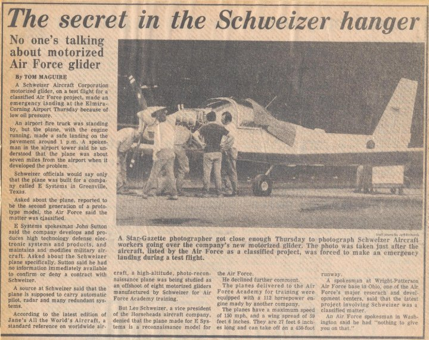

| Year | Semester | CourseID | CourseDesc             | Units | | Grade | Events |
|------|----------|----------|------------------------|-------|---------------------------|-------|--------|
|      | Fall     |     |        |    |                        |  |   |
|      | Spring   |  LionCountry,FL EpcotBike |        |    |                 |      |   |

# A German Connection to *One Thousand and One Nights* in the Context of Rommel's North African Campaign

At first glance, **Erwin Rommel's North African campaign** and **One Thousand and One Nights** appear unrelated. One belongs to twentieth-century military history, the other to medieval literature. However, they intersect through Germany's long-standing scholarly and cultural interest in the Middle East.

## Germany's Long Fascination with the Orient

Long before World War II, German scholars, writers, and artists were deeply interested in the cultures of the Middle East.

Notable examples include:

- **Johann Wolfgang von Goethe's** *West–Eastern Divan* (1819), inspired by Persian poetry.
- German translations of *One Thousand and One Nights* throughout the 18th and 19th centuries.
- German universities becoming leading centers for the study of Arabic, Persian, and Islamic history.
- Archaeological expeditions to Mesopotamia, Egypt, and the Levant.

By the early twentieth century, educated Germans would likely have recognized stories such as **Scheherazade**, **Sindbad**, and **Ali Baba**, much as educated Britons or French readers would.

---

## Rommel's North African Theater

When Rommel arrived in Libya in 1941, he entered a landscape that had long captured the European imagination:

- caravan routes
- desert fortresses
- ancient Roman ruins
- Arab and Berber societies
- cities such as Tripoli and Benghazi

These places were geographically connected to the broader world that had inspired many stories associated with *One Thousand and One Nights*, even though the tales themselves originated across a much wider region stretching from Persia and Iraq to Egypt and Syria.

---

## Military Reality vs. Literary Imagination

It is important to distinguish between the literary world of *One Thousand and One Nights* and the historical reality of Rommel's campaign.

The literary world features:

- merchants
- storytellers
- caliphs
- bustling marketplaces
- magical adventures

Rommel's campaign involved:

- armored divisions
- mechanized warfare
- aircraft
- logistics
- fuel shortages
- modern military strategy

The connection is therefore **cultural rather than operational**.

---

## A Shared European Imagination

For many Europeans during the nineteenth and early twentieth centuries, North Africa and the Middle East occupied a place in the imagination shaped by:

- biblical history
- classical antiquity
- Orientalist art
- travel literature
- *One Thousand and One Nights*

As a result, German soldiers serving in North Africa—including Rommel's troops—were operating in a region that many back home already associated with centuries of stories and historical fascination.

---

## A Historical Perspective

Rather than seeing Rommel's campaign as connected to *One Thousand and One Nights* directly, it is more accurate to view both as part of Germany's broader historical engagement with the Middle East:

- **Literary engagement** through translations, scholarship, and appreciation of Persian and Arabic classics.
- **Academic engagement** through Oriental studies, archaeology, and language scholarship.
- **Military engagement** during World War II in North Africa.

These represent different forms of interaction with the same broad region across different centuries.

---

## Summary

| Topic | Connection |
|--------|------------|
| **One Thousand and One Nights** | Medieval literary tradition from Persia, Iraq, Egypt, and the wider Islamic world, widely translated and admired in Germany. |
| **German Cultural Interest** | German scholars, writers, and readers developed a strong appreciation for Middle Eastern literature, history, and languages during the 18th and 19th centuries. |
| **Erwin Rommel** | Commanded German forces in North Africa (1941–1943), achieving early successes through innovative armored tactics. |
| **Relationship** | The connection is **cultural and historical**, not causal. Rommel's military operations were not influenced by *One Thousand and One Nights*, but they took place in a region that had long occupied an important place in the German cultural imagination through literature, scholarship, and history. |
