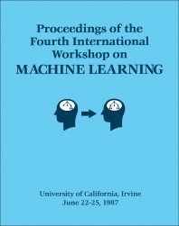

# *One Thousand and One Nights* (The Arabian Nights): Brief Overview

*One Thousand and One Nights* (*Alf Layla wa-Layla*) is one of the world's most influential collections of folk tales. It is **not a single book written by one author**, but rather a compilation of stories gathered and expanded over several centuries from across the **Middle East, Persia, India, and the broader Islamic world**.

The collection reached its classic Arabic form between the **9th and 15th centuries**, although many stories are considerably older.

---

# The Framing Story

The entire collection is connected by the famous story of **Scheherazade**.

- King Shahryar, believing all women to be unfaithful, marries a new bride each evening and executes her the following morning.
- Scheherazade volunteers to marry him.
- Each night she tells a fascinating story but deliberately stops before the ending.
- Curious to hear the conclusion, the king postpones her execution.
- After **1,001 nights**, the king abandons his cruel practice.

This framing narrative is generally believed to have **Persian roots**, though the surviving version is Arabic.

---

# Major Cultural Sources

| Region | Primary Contributions |
|---------|----------------------|
| **India** | Animal fables, wisdom literature, magical tales |
| **Persia (Iran)** | Courtly romances, the framing story, heroic adventures |
| **Iraq (Baghdad)** | Abbasid-era stories, merchants, caliphs, urban life |
| **Egypt** | Cairo tales, tricksters, romances, comedy |
| **Syria** | Merchant adventures and oral storytelling traditions |
| **Arabian Peninsula** | Bedouin tales, poetry, desert folklore |
| **Later Ottoman World** | Editorial additions and later adaptations |

---

# Major Stories

The exact contents vary among surviving manuscripts. There is **no single definitive edition**, and different versions include different stories.

## 1. The Frame Story

- **Scheherazade and King Shahryar**
- **Cultural Origin:** Persian (adapted into Arabic)

---

## 2. Merchant Cycle

Includes:

- The Merchant and the Jinni
- The Fisherman and the Jinni
- The Three Apples
- The Hunchback

**Origin**

- Primarily Iraqi (Baghdad)
- Persian influences

---

## 3. Sindbad the Sailor

The famous Seven Voyages include encounters with:

- Giant Roc birds
- Sea monsters
- Cannibals
- The Old Man of the Sea
- The Valley of Diamonds
- Enchanted islands

**Origin**

A blend of:

- Persian seafaring traditions
- Basra merchant culture
- Indian Ocean trade
- Indian folklore

---

## 4. Ali Baba and the Forty Thieves

Famous for the phrase:

> "Open Sesame."

**Origin**

Probably Syrian or Egyptian.

This story **does not appear in the oldest Arabic manuscripts**. It became famous after French translator **Antoine Galland** recorded it from the Syrian storyteller **Hanna Diyab** in the early 1700s.

---

## 5. Aladdin and the Wonderful Lamp

Features:

- The magical lamp
- The genie
- The flying palace
- An enchanted magician

**Origin**

Also introduced by **Antoine Galland** from the oral stories of **Hanna Diyab**.

Although commonly thought of as an Arabic tale, it is set in a fantastical version of **China** with strong Islamic cultural elements.

---

## 6. The Ebony Horse

A magical mechanical flying horse transports princes across great distances.

**Origin**

Persian

---

## 7. The City of Brass

An expedition searches for a legendary abandoned city filled with ancient wonders.

**Origin**

Arabic

Inspired by:

- Qur'anic traditions
- Ancient Near Eastern ruins
- Late Antique legends

---

## 8. Prince Ahmed and the Fairy Pari Banu

Features:

- Flying carpets
- Magical objects
- Fairy kingdoms

**Origin**

Persian

---

## 9. Hasan of Basra

A romance involving supernatural beings and enchanted kingdoms.

**Origin**

Iraqi (Basra)

---

## 10. Julnar of the Sea

A princess from an underwater kingdom marries a human king.

**Origin**

Persian-Arabic

---

## 11. The Porter and the Three Ladies of Baghdad

One of the largest interconnected narrative cycles in the collection.

**Origin**

Baghdad

---

## 12. Nur al-Din and Anis al-Jalis

A romantic adventure involving court intrigue and mistaken identities.

**Origin**

Egyptian

---

## 13. Ma'ruf the Cobbler

A poor cobbler's fortunes change through wit and magical intervention.

**Origin**

Egyptian

---

## 14. Abu Muhammad the Lazy

A humorous morality tale.

**Origin**

Egyptian

---

## 15. The Three Apples

Often considered one of history's earliest detective mysteries.

**Origin**

Baghdad

---

## 16. The Hunchback Cycle

A comic chain of misunderstandings involving multiple storytellers.

**Origin**

Egyptian

---

## 17. Stories of Caliph Harun al-Rashid

The Abbasid caliph appears in many adventures, including stories involving:

- Abu Hasan
- Ja'far the Vizier
- The Barber
- The Three Ladies of Baghdad

**Origin**

Baghdad during the Abbasid Golden Age

---

# Stories Added Through European Translation

Several of today's best-known tales entered the tradition through **Antoine Galland's** French translation (1704–1717), based largely on stories told to him by the Syrian storyteller **Hanna Diyab**.

These include:

- **Aladdin and the Wonderful Lamp**
- **Ali Baba and the Forty Thieves**
- **Prince Ahmed and the Fairy Pari Banu**
- Several additional fairy tales

Although absent from the oldest Arabic manuscripts, they are now universally considered part of the *Arabian Nights* tradition.

---

# Religious and Cultural Setting

The stories reflect the diverse civilizations of the medieval Islamic world, incorporating elements from:

- Islamic law and customs
- Persian royal traditions
- Indian mythology
- Greek scientific knowledge
- Jewish communities
- Christian communities
- Zoroastrian influences
- Silk Road commerce
- Indian Ocean maritime trade

Rather than representing a purely "Arabian" work, *One Thousand and One Nights* is a literary mosaic created through centuries of cultural exchange.

---

# Lasting Cultural Influence

*One Thousand and One Nights* has profoundly influenced world literature and popular culture. It introduced enduring themes such as:

- Clever storytellers
- Magical lamps
- Genies
- Flying carpets
- Hidden treasure
- Enchanted cities
- Sea voyages
- Lost civilizations
- Wise rulers and cunning tricksters

Its influence can be seen in the works of **Voltaire**, **Goethe**, **Edgar Allan Poe**, **Jorge Luis Borges**, and countless modern novels, films, television series, and adaptations.

At its heart, *One Thousand and One Nights* serves as a remarkable cultural crossroads, preserving centuries of storytelling traditions from **India, Persia, the Arab world, and the broader Islamic civilization**, all woven together through the unforgettable voice of **Scheherazade**.

# THE ST. THOMAS COMMON SENSE SYMPOSIUM:

This meeting was held in St. Thomas, U. S. Virgin Islands, on April 14-16, 2002. The meeting included the following participants: Larry Birnbaum, Ken Forbus, Ben Kuipers, Douglas Lenat, Henry Lieberman, Henry Minsky, Marvin Minsky, Erik Mueller, Srini Narayanan, Ashwin Ram, Doug Riecken, Roger Schank, Mary Shepard, Push Singh, Jeffrey Mark Siskind, Aaron Sloman, Oliver Steele, Linda Stone, Vernor Vinge, and Michael Witbrock. 

[Roger Schank w/ Case-Based Reasoning](https://en.wikipedia.org/wiki/Case-based_reasoning) w/ [Wendy Lehnert](https://en.wikipedia.org/wiki/Wendy_Lehnert) ( [Wendy Lehnert w/ Tile Sliding](https://cdn.aaai.org/AAAI/1988/AAAI88-024.pdf) ) & [Janet Kolodner](https://www.sciencedirect.com/science/chapter/edited-volume/abs/pii/B9780934613415500210)

## DESIGNING ARCHITECTURES FOR HUMAN-LEVEL INTELLIGENCE

[https://cogaffarchive.org/AIMag/StThomas-AIMag.pdf](https://cogaffarchive.org/AIMag/StThomas-AIMag.pdf)

["One Thousand and One Nights" by Hanan Al-Shaykh Hanan Al-Shaykh (Author) ](https://www.amazon.com/One-Thousand-Nights-AL-SHAYKH-HANAN/dp/140882776X)

( [MOSSAD](https://en.wikipedia.org/wiki/Mossad) x [Quds Force](https://en.wikipedia.org/wiki/Quds_Force) ) / [Boltzmann machine](https://en.wikipedia.org/wiki/Boltzmann_machine)

# Temporal Reasoning Example: Who Took the Microfilm?

One of the classic examples in AI temporal reasoning comes from the 1994 AAAI paper **"Temporal Reasoning with Constraints on Fluents and Events"** by Eddie Schwalb, Kalev Kask, and Rina Dechter. The paper introduces a logical language for representing **events**, **states of the world (fluents)**, and **temporal constraints** so that an AI system can reason about what **must have happened**, **what could have happened**, and **what is impossible**. :contentReference[oaicite:0]{index=0}

---

## The Story

Imagine the following situation:

> **8:00 AM:** The microfilm is deposited in a secure safe.
>
> **11:00 AM:** The microfilm is discovered to be missing.
>
> **John's whereabouts**
> - At the bar from **8:10–8:30**
> - At the poker table from **8:35–9:00**
> - Back at the bar from **9:10–12:00**
>
> **Fred's whereabouts**
> - At the bar from **8:30–10:00**
> - Back at the bar from **10:45–12:00**
>
> The bar is open from **7:30 AM to 12:00 PM**.
>
> Anyone who leaves the bar, steals the microfilm, and returns requires **at least 15 minutes**.

Now suppose we ask:

- **Did Fred take the microfilm?**
- **Could John have taken the microfilm?**
- **What are all of the possible sequences of events that satisfy every fact in the story?**

Humans can reason through these questions fairly naturally, even without knowing the exact distances or walking speeds. The challenge is enabling a computer to perform the same kind of reasoning. :contentReference[oaicite:1]{index=1}

---

## Why This Problem Is Interesting

The problem is **not** simply keeping track of times.

Instead, an AI system must combine several different kinds of information:

- Facts that are always true (the microfilm was present at 8:00).
- Facts that change over time (the microfilm disappears before 11:00).
- People's locations during different intervals.
- Constraints on how long actions require.
- Unknown events that may or may not have occurred.

The AI must determine **which possible worlds (scenarios)** satisfy every constraint simultaneously.

---

## The Paper's Main Idea

The paper introduces a language called **HOT (Holds, Occurs, Temporal)**.

Rather than representing only facts, HOT represents three kinds of information:

### 1. Holds

A **fluent** (a property that can change over time) is true during an interval.

Examples:

- The microfilm is in the safe.
- John is at the bar.
- Fred is at the poker table.

These are represented as:

```text
Holds(fluent, start_event, end_event)
```

---

### 2. Occurs

Represents events that may or may not happen.

Examples:

- John steals the microfilm.
- Fred leaves the bar.
- The safe is opened.

```text
Occurs(event)
```

---

### 3. Temporal Constraints

Relationships between events.

Examples:

- Event A happens before Event B.
- Two events are 15 minutes apart.
- One interval overlaps another.

The language supports both:

- **Qualitative relationships**
  - before
  - after
  - overlaps
  - during
  - starts
  - finishes

- **Quantitative timing constraints**
  - exact times
  - minimum durations
  - allowable time intervals

:contentReference[oaicite:2]{index=2}

---

## Why "Fluents"?

A **fluent** is simply a property whose truth can change over time.

For example:

| Time | Microfilm in Safe |
|------|--------------------|
| 8:00 | True |
| 9:30 | True |
| 10:10 | False |
| 11:00 | False |

Unlike ordinary logical propositions (such as **2 + 2 = 4**), fluents are **time-dependent**.

---

## Reasoning About Possibilities

Instead of trying to guess exactly what happened, the system searches for **consistent scenarios**.

A scenario is a complete assignment of:

- which events occurred,
- when they occurred,
- which fluents were true during which intervals,

while satisfying every temporal constraint.

The AI can then answer questions such as:

- Must Fred have stolen the film?
- Could John have stolen it?
- Are both possible?
- Is neither possible?

This style of reasoning is much closer to **detective work** than traditional programming.

---

## Why This Was Important

Many earlier temporal logic systems were expressive but computationally expensive.

The contribution of this paper was to combine:

- propositional logic,
- temporal interval reasoning,
- constraint satisfaction,

into a framework where much of the reasoning could leverage existing constraint propagation algorithms.

Rather than answering only **yes/no** questions, the system computes every **consistent scenario**, allowing it to determine:

- what **must** have occurred,
- what **might** have occurred,
- what **could not** have occurred.

:contentReference[oaicite:3]{index=3}

---

## Why It Still Matters Today

Although published in **1994**, this paper illustrates ideas that remain central to modern AI:

- Knowledge Representation
- Automated Reasoning
- Planning
- Constraint Satisfaction
- Event Reasoning
- Commonsense Inference

Modern AI agents still need to reason about:

- calendars,
- schedules,
- workflows,
- robotics,
- autonomous vehicles,
- business processes,

where actions have temporal constraints and events change the state of the world.

---

## Key Takeaway

This paper demonstrates that intelligent reasoning is not just about storing facts—it is about reasoning over **time**, **events**, and **changing states of the world**.

By representing:

- what is true,
- what happened,
- when events occurred,
- and how events constrain one another,

an AI system can infer what is **possible**, **necessary**, and **impossible**, much like a human detective reconstructing the events surrounding a mystery.

---

## Reference

Schwalb, E., Kask, K., & Dechter, R. (1994). **Temporal Reasoning with Constraints on Fluents and Events.** *Proceedings of the Twelfth National Conference on Artificial Intelligence (AAAI-94).* :contentReference[oaicite:4]{index=4}

**ResearchGate (full paper):**

https://www.researchgate.net/publication/2641853_Temporal_Reasoning_with_Constraints_on_Fluents_and_Events#fullTextFileContent

(PDF) Temporal Reasoning with Constraints on Fluents and Events. Available from: https://www.researchgate.net/publication/2641853_Temporal_Reasoning_with_Constraints_on_Fluents_and_Events#fullTextFileContent [accessed Jul 30 2026].

| 1 | 0 | 0 | 1 |
|------|----------|----------|----------|
|  |     | |  |
|  |     | |  |


[Long Island Lolita](https://en.wikipedia.org/wiki/Amy_Fisher)

[Long Island Iced Tea](https://en.wikipedia.org/wiki/Long_Island_iced_tea)

[Benjamin Netanyahu](https://en.wikipedia.org/wiki/Benjamin_Netanyahu) / [Henry Kissinger](https://en.wikipedia.org/wiki/Henry_Kissinger) / [Golda Meir](https://en.wikipedia.org/wiki/Golda_Meir)


# Westec Security, Nicole Brown Simpson, and the O.J. Simpson Trial

[https://en.wikipedia.org/wiki/National_Crime_Syndicate](https://en.wikipedia.org/wiki/National_Crime_Syndicate)

## Overview

During the 1995 murder trial of **O.J. Simpson**, prosecutors sought to establish a long history of domestic violence against **Nicole Brown Simpson**. One important piece of evidence involved a prior incident in which Nicole called for help during a domestic disturbance.

The prosecution argued that the response by **Westec Security** and the **Los Angeles Police Department (LAPD)** demonstrated that Simpson's abusive behavior had been documented well before the murders of Nicole Brown Simpson and Ronald Goldman.

---

# The Domestic Disturbance

On an earlier occasion before the murders, Nicole Brown Simpson contacted emergency services after an altercation with O.J. Simpson.

According to testimony presented during the trial:

- Nicole requested assistance because she feared for her safety.
- **Westec Security**, the private security company monitoring her residence, received and responded to the alarm or distress call.
- The LAPD also responded, including **Officer Mark Fuhrman**.

The prosecution used this incident as evidence that the abuse was not isolated but part of a continuing pattern.

---

# Westec Security

## What Was Westec?

Westec Security was a major **Los Angeles-area private security company** during the late 1980s and early 1990s.

The company specialized in:

- Residential alarm monitoring
- Commercial security systems
- Emergency dispatch services
- Coordination with local law enforcement

Unlike many modern systems that simply notify police, monitored alarm companies such as Westec often:

1. Received alarm activations or panic signals.
2. Contacted the homeowner when possible.
3. Dispatched private security personnel if appropriate.
4. Requested police assistance when criminal activity or personal danger was suspected.

This combination of private monitoring and public law enforcement was common for affluent neighborhoods in Los Angeles.

---

## Nicole Brown Simpson's Home

Nicole's residence was equipped with a monitored security system through Westec.

When she activated or used the system to seek assistance:

- Westec personnel responded according to company procedures.
- The incident resulted in an LAPD response.

This demonstrated that documented third-party records existed outside Nicole's own statements.

---

# Officer Mark Fuhrman

Officer **Mark Fuhrman** was among the officers who responded to one of Nicole's earlier domestic violence calls.

Years later, after Nicole's murder, Fuhrman became one of the detectives involved in the murder investigation.

During the trial:

- Prosecutors viewed his earlier response as additional evidence that Nicole had previously reported abuse.
- The defense later attacked Fuhrman's credibility after audio recordings surfaced in which he used racist language and discussed police misconduct.

Those revelations became one of the defining controversies of the trial.

---

# Why the Prosecution Introduced This Evidence

The prosecution's goal was not simply to describe one police call.

Instead, they sought to establish:

- A documented history of domestic violence.
- Evidence that Nicole feared O.J. Simpson.
- Independent witnesses who had observed or responded to prior incidents.
- Corroboration from police reports and security records.

This pattern evidence was intended to support the prosecution's argument that the murders were the culmination of escalating domestic abuse.

---

# Significance of Westec Security

Westec played an important but often overlooked role in the overall story.

Its involvement showed that:

- Nicole had access to professional emergency assistance beyond simply calling 911.
- Independent security personnel were involved in responding to at least one incident.
- Records from a private security company could corroborate the timing and existence of emergency calls.
- The domestic violence allegations were supported by multiple sources, including private security personnel and law enforcement.

Although Westec itself was not a central focus of the trial, its response formed part of the prosecution's broader effort to demonstrate a documented history of domestic abuse preceding the murders.

---

# Historical Context

The O.J. Simpson trial brought unprecedented public attention to the issue of domestic violence. Prior to the murders, O.J. Simpson had pleaded **no contest** in 1989 to spousal abuse charges stemming from another incident involving Nicole Brown Simpson.

The prosecution argued that earlier responses by neighbors, Westec Security, and the LAPD illustrated a long-standing pattern of violence. The defense, while not denying that prior domestic incidents had occurred, challenged the prosecution's interpretation of the evidence and focused heavily on attacking the integrity of the murder investigation.

Today, many legal scholars view the trial as a turning point in public awareness of domestic violence, particularly regarding how repeated prior incidents may serve as warning signs before lethal violence occurs.

# Nuisance IT Issues

## Overview

Not every IT failure is a catastrophic cyberattack or system collapse. Many organizations experience **nuisance IT issues**—unexpected technical disruptions that temporarily interfere with normal operations without causing long-term damage. While often short-lived, these incidents can still create significant inconvenience for customers, employees, and businesses.

A recent example was the **American Airlines outage**, where technology problems temporarily disrupted flight operations, delaying departures and affecting travelers. Although the issue was resolved relatively quickly, it demonstrated how dependent modern organizations are on complex interconnected information systems.

## Characteristics of Nuisance IT Issues

- Usually temporary and recoverable.
- May affect only portions of a system or specific services.
- Often caused by software bugs, configuration errors, network failures, hardware faults, or cloud service disruptions.
- Can inconvenience thousands or even millions of users despite lasting only minutes or hours.
- Typically do not result in permanent data loss.

## Common Examples

- Airline reservation or scheduling outages
- Retail point-of-sale system failures
- Temporary banking or ATM outages
- Cloud service interruptions
- Email server downtime
- Authentication or login problems
- Payment processing delays
- Internet service provider disruptions

## Business Impact

Even relatively minor IT issues can produce measurable consequences:

- Reduced customer confidence
- Lost productivity
- Delayed services
- Financial losses from interrupted operations
- Increased support requests
- Damage to organizational reputation

## Lessons Learned

Organizations reduce the impact of nuisance IT issues by investing in:

- Redundant systems
- Automated monitoring and alerting
- Disaster recovery procedures
- Incident response teams
- Regular testing and maintenance
- Clear customer communication during outages

## Key Takeaway

Nuisance IT issues are an unavoidable part of operating modern digital infrastructure. Although they rarely threaten an organization's survival, they highlight the importance of resilient system design, rapid incident response, and effective communication to minimize disruption.
