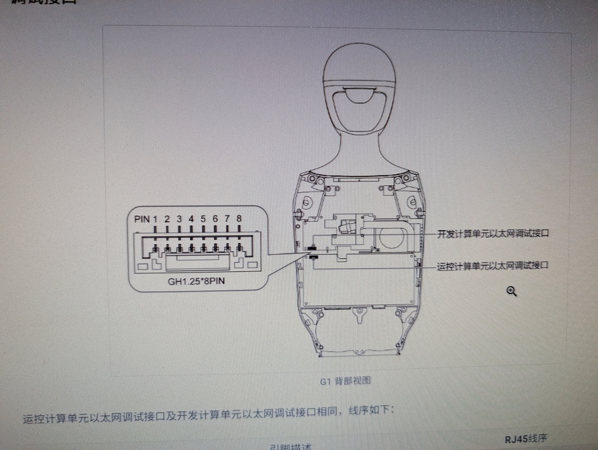
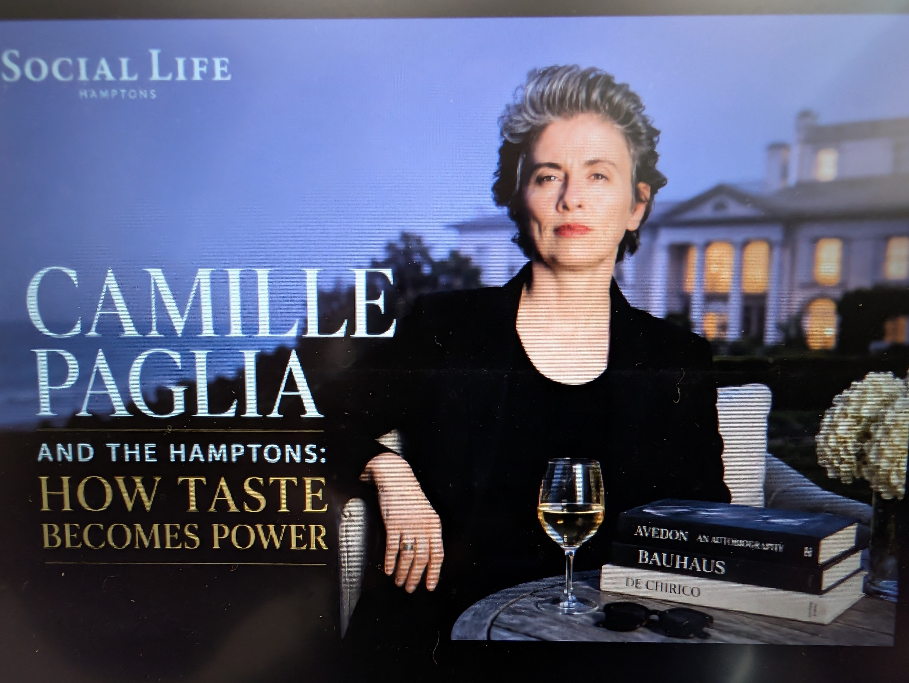
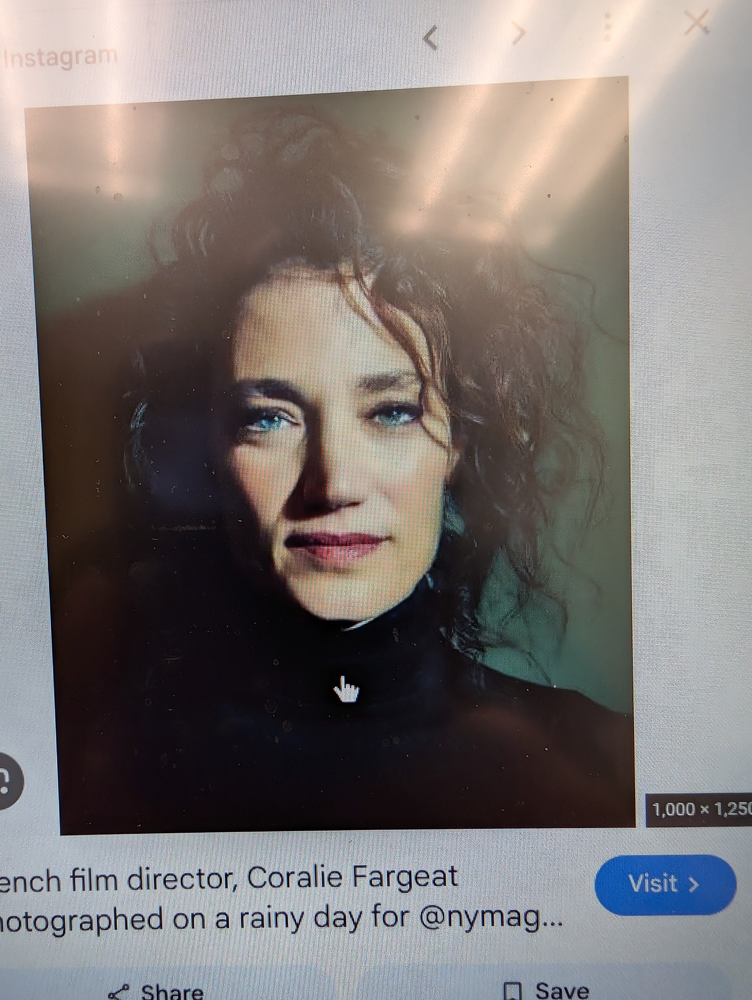
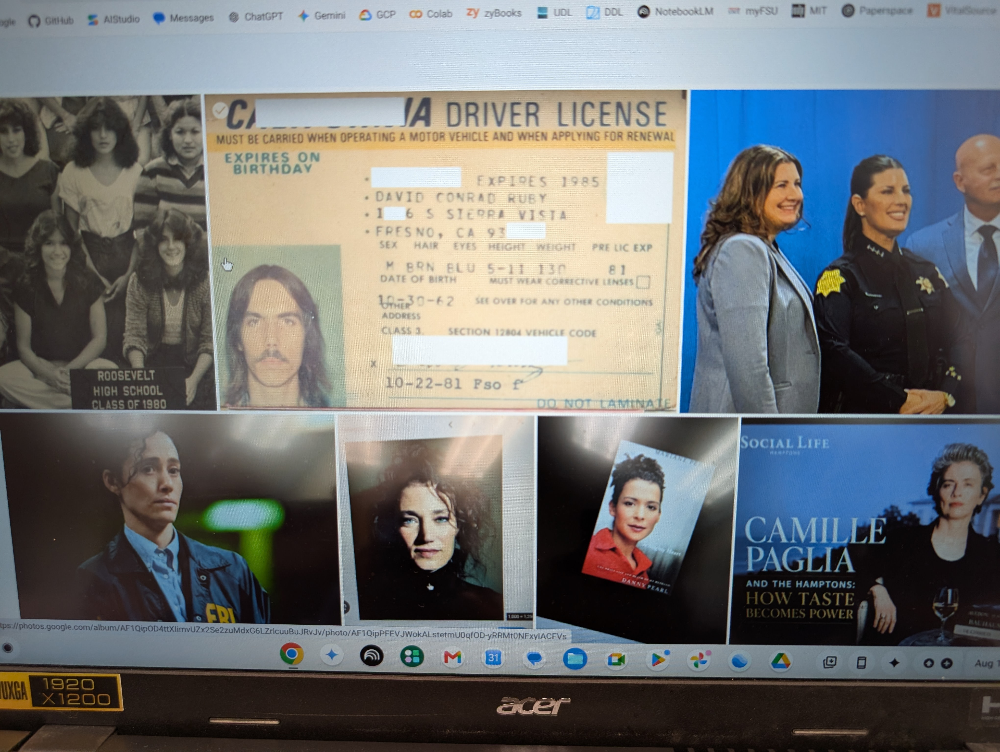
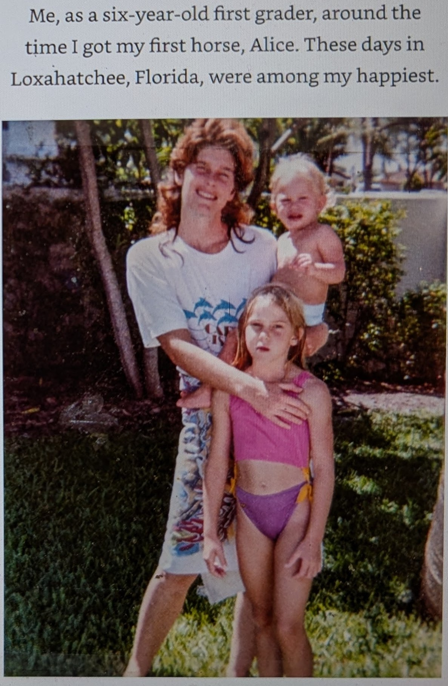
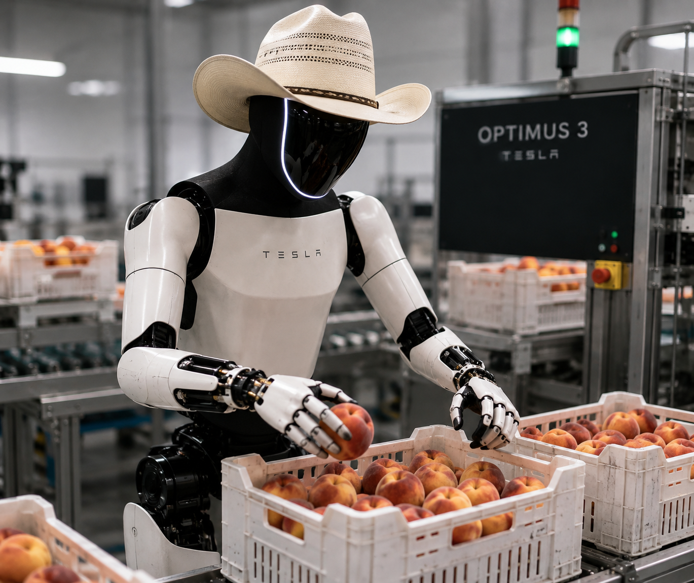

# The Photo (Gamma not Beta)

| | | |
|--|--|--|
|  | (1) [goal1, risk1] Clear/Recognized</br>*How Handle??*</br> <a href="g1-fixedbase-step-0.mp4">  </a></br>(2) Sol=[Act1, Act2, Act3] ; Exec Sol</br>(3) State=[True(goal1), False(Risk1)]   |  |
| </br> Pick A Sticker.</br>Bully Groups | ```import isaaclab_tasks```</br>```from isaaclab_tasks.utils import parse_env_cfg```</br>```env_cfg = parse_env_cfg(```</br>```  "Isaac-PickPlace-FixedBaseUpperBodyIK-G1-Abs-v0",```</br>```  device="cuda:0",num_envs=1)```</br></br> **Trauma Symptoms:** </br> Mal-adaptations |  |

| | | | |
|---|---|---|---|
|  </br>Physical Trauma vs. Mental Trauma</br>*Trauma Trigger Tokens* |  |  |  |

# Considering Context Tokens


# Robotic Automation for Fruit Packing Industry
Looking for Seasonal Work.</br> 
| | |  | |
|---|---|---|---|
| |  | | <a href="g1-fixedbase-step-0.mp4">  </a> |

Will Work tirelessly and consistently for hours without breaks.</br>
Desired salary: $1.00 an hour.

# Boozy Bonfire Parties or "Figure It Out... I'm Busy!"
## A quote from Nobody's Girl: A Memoir of Surviving Abuse and Fighting for Justice (2025)
## by Virginia Roberts Giuffre

> When I was eleven, I got my period. For years, as adults had forced me to do things no child should know about, I’d been praised sometimes for acting “grown up.” But no one had bothered to tell me what happened when a girl actually grew up. I had no idea what was coming. I remember being outside at one of my parents’ boozy bonfire parties, running around with some other kids, when I looked down at my jeans and saw a creeping red stain. Was I bleeding to death? I wondered. Pale and terrified, I sought out Mom, who glared at me as she appraised my bloody pants. Then, without putting down her beer, she headed into the house, scrounged around in the cupboard under the bathroom sink, and handed me a sanitary pad. “Figure it out,” she said, turning on her heel and leaving me alone. Locking the door behind her, I sat down on the toilet and cried.

# Coralie Fargeat — *Revenge*, *The Substance*, and *Furious*

## Coralie Fargeat

**Coralie Fargeat** is a French writer-director known for intense, visually stylized films centered on **female experience, violence, transformation, power, and control**.

Her films often use extreme situations and physical imagery rather than conventional realism. Violence and the body become ways of making psychological and social forces visible.

### *Revenge* (2017)

Fargeat's feature debut takes the revenge-thriller structure and transforms it into a story of survival, transformation, and reclaimed agency.

Key elements:

* Predator/prey reversal
* Female survival
* Extreme physical violence
* Hostile environments
* Transformation through experience
* Reversal of existing power relationships

> The victim does not merely escape the system—she changes sufficiently to confront it.

### *The Substance* (2024)

Written and directed by Fargeat, *The Substance* moves from external violence toward **body horror, identity, aging, beauty, objectification, and internalized control**.

The protagonist attempts to create an optimized version of herself, but the process increasingly turns the self into both **controller and controlled**.

A useful progression is:

```text
Revenge
External predator
      ↓
Survival
      ↓
Transformation
      ↓
Reclaimed agency

The Substance
External social pressure
      ↓
Internalized pressure
      ↓
Transformation
      ↓
Self becomes the battleground
```

---

## Fargeat's Style

Across *Revenge* and *The Substance*, recurring elements include:

* Strong female protagonists
* Extreme transformation
* Bodies used as narrative symbols
* Violence pushed toward surrealism
* Bold visual composition
* Intense sound design
* Limited reliance on exposition
* Power relationships expressed physically

A useful way of describing her approach:

> Fargeat takes social and psychological pressures and exaggerates them until their underlying violence becomes physically visible.

---

# *Furious* — Hulu (2026)

***Furious*** is a Hulu crime thriller created, written, and executive produced by **Elizabeth Meriwether**, starring **Emmy Rossum** and **Lola Petticrew**.

Rossum plays FBI agent **Alice Black**, who pursues a mysterious and calculating female serial killer played by Petticrew.

As their lives increasingly intersect, the conventional distinction between investigator and killer—and between justice and wrongdoing—begins to blur.

The series explores:

* Female violence
* Trauma
* Revenge
* Justice
* Moral ambiguity
* Psychological transformation
* Hunter/pursued relationships

---

## Interesting Connection

Although *Furious* is unrelated creatively to Fargeat, it provides an interesting contemporary comparison:

```text
Revenge
→ Victim becomes hunter

The Substance
→ Self becomes both predator and victim

Furious
→ Hunter and hunted increasingly mirror one another
```

All three place women within extreme systems of violence and ask what those systems do to the individuals operating within them.

The common question becomes:

> **When someone spends enough time inside a violent system, how does that system transform her?**

This makes *Revenge*, *The Substance*, and *Furious* interesting companion works for examining **female agency, violence, transformation, identity, and the instability of the boundary between victim and predator**.


